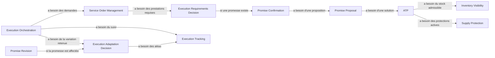

# Audit des dépendances — v007 / U249

16 septembre 2026. Analyse du modèle publié `2026-09-16.2`. Toutes les relations ci-dessous sont des recommandations d'audit, sauf celles explicitement indiquées comme déjà représentées. Aucun nœud, relation ou type de relation du modèle n'est modifié.

## Constat vérifiable

Les 74 relations se répartissent en **41 `contains`, 12 `presents`, 18 `relates-to`, 2 `provides-conditions` et 1 `provides-knowledge`**. Il existe donc **21 relations transversales**, dont 18 entre capacités et trois au niveau domaines/référentiel. Les 53 autres expriment la structure ou la présentation.

**22 capacités sur 41 ne sont extrémité d'aucune relation transversale explicite.** Ce constat comprend les six ingestions ; leur absence de liaison directe vers chaque consommateur n'est pas en elle-même une anomalie. Il reste **16 capacités opérationnelles ou décisionnelles sans relation transversale** : les six de D01, huit des neuf de D03 (seule Promise Revision est reliée), Order Structuring et Order Lifecycle Management. Les liens textuels `model:` et les principes expriment parfois la dépendance, mais ne remplacent pas une relation structurée.

Les descriptions ne permettent pas de lire toutes les flèches de la même manière. Par exemple :

| Relation actuelle | Sens réel du texte | Lecture « a besoin de » |
| --- | --- | --- |
| Inventory Planning → Replenishment Decision | Le premier mobilise la seconde | Même sens |
| Execution Tracking → Execution Orchestration | Le premier fournit des faits à la seconde | Sens inverse |
| Execution Adaptation Decision → Execution Orchestration | Une variation retenue alimente la coordination | Sens inverse |
| Execution Service Decision → Execution Capacity Visibility | La décision utilise la visibilité | Même sens |
| Execution Reconciliation → Sales Order Management | Des faits imputés alimentent le rapprochement de l'Order | Sens inverse |

Cette coexistence n'invalide pas les relations métier ; elle empêche une exploration uniforme des dépendances si l'interface interprète la flèche sans son sens qualifié.

## Convention proposée

Pour une vue de dépendances, retenir **consommateur → fournisseur**, libellé **« a besoin de »**. Un besoin porte sur un **résultat métier identifié**, pas simplement sur le nom d'une capacité. Le flux d'information, s'il est affiché, circule dans l'autre sens et doit être distingué.

Décrire chaque dépendance par : consommateur, fournisseur, résultat nécessaire, condition d'utilisation, maille et validité pertinentes, source de la justification, statut proposé/adopté. Une date de fraîcheur, un horizon, une unité ou un périmètre sont des éléments du contrat lorsqu'ils influencent la décision ; le protocole technique n'est pas le contrat métier.

Ne pas convertir automatiquement tous les `relates-to` en `needs`. Réexaminer leur qualification une par une ; préserver les identifiants et l'historique lors d'une éventuelle mise à jour. Définir le sens d'un nouveau type dans le schéma avant de l'introduire. Les relations `contains`/`presents` restent séparées.

Un lien n'impose ni appel synchrone, ni séquence universelle, ni contrôle humain, ni dépendance entre applications. Les boucles de retour sont normales : une promesse peut être réexaminée après un aléa. Il faut expliquer les résultats échangés et leurs versions, pas interdire tout cycle.

## Dépendances à expliciter en priorité

Une ligne peut regrouper plusieurs liens à instruire. **Ce tableau n'est pas un ensemble de relations déjà adoptées, ni un décompte de relations à créer.** « Absente » signifie absente du graphe publié ; la responsabilité peut être explicite dans le texte. Tous les consommateurs/fournisseurs de cette première table sont des capacités existantes. Les liens vers les référentiels et fournisseurs externes suivent dans une table distincte.

| Priorité / repère | Capacité consommatrice | A besoin de | Résultat et condition | État dans le graphe v007 |
| --- | --- | --- | --- | --- |
| P1 / DEP01 | Inventory Tracking — D01.f | Record Inventory Movements — D01.g | Faits de stock reconnus expliquant les variations ; distinguer date du fait et connaissance tardive | Absente |
| P1 / DEP02 | Inventory Visibility — D01.c | Inventory Tracking — D01.f | Situation présente/attendue par produit, lieu, détenteur/propriétaire si pertinents, provenance et fraîcheur | Absente |
| P1 / DEP03 | Stocktaking — D01.d | Inventory Tracking — D01.f | Quantités enregistrées à comparer au comptage, à périmètre et instant compatibles | Absente |
| P1 / DEP04 | Record Inventory Movements — D01.g | Stocktaking — D01.d ; Execution Tracking — D07.d | Corrections justifiées de comptage ; faits d'exécution reconnus comme mouvements. Tout statut logistique n'est pas un mouvement ; ne pas attendre nécessairement le rapprochement final | Absentes |
| P1 / DEP05 | Inventory Tracking — D01.f | Execution Tracking — D07.d | Ressources futures et changements d'estimation lorsqu'ils sont connus ; ne pas additionner un attendu et sa réception | Absente |
| P1 / DEP06 | ATP — D03.i | Inventory Visibility — D01.c ; Supply Protection — D02.b ; Reservation — D02.c | Stock/ressources admissibles, droits d'usage et engagements actifs ; éviter de soustraire deux fois une réservation déjà prise en compte | Absentes |
| P1 / DEP07 | ATP — D03.i ; CTP — D03.j ; Delivery Schedule Decision — D03.l | Execution Capacity Visibility — D06.b | Capacité utile à la proposition datée, avec unité, fenêtre, périmètre et fraîcheur ; distinguer maximum, charge et disponibilité, inconnues explicites | Seulement D06 → D03 au niveau domaine ; détail proposé |
| P1 / DEP08 | Promise Proposal — D03.a | ATP — D03.i ; CTP — D03.j ; PTP — D03.k ; Delivery Schedule Decision — D03.l | Solutions et échéancier ; CTP si adaptation envisagée, PTP si arbitrage économique applicable. Aucun pipeline obligatoire ATP→CTP→PTP | Absentes |
| P1 / DEP09 | CTP — D03.j | Inventory Visibility — D01.c ; Order Prioritization — D03.m ; Execution Service Decision — D06.e | Ressources, concurrence des besoins et moyens exécutables pour construire une variante de satisfaction. Ne pas appliquer par ce seul calcul les changements proposés | Absentes |
| P1 / DEP10 | PTP — D03.k | ATP — D03.i ; CTP — D03.j | Scénarios comparables en résultat/service et leurs conséquences économiques. Fournisseur des coûts/marges externes à préciser, sans créer un domaine finance | Absentes |
| P1 / DEP11 | Promise Confirmation — D03.b | Promise Proposal — D03.a ; Supply Assignment — D02.e ; Reservation — D02.c | Proposition retenue et effets d'engagement autorisés. Préciser qui confirme quoi, comment éviter la concurrence, et les cas où aucune réservation ferme n'est requise | Absentes ; contrat à arbitrer |
| P1 / DEP12 | Supply Assignment — D02.e | Inventory Visibility — D01.c ; Supply Protection — D02.b ; Reservation — D02.c ; Order Prioritization — D03.m | Ressources admissibles et engagements/priorités pour affecter, réaffecter ou libérer. Affectation et réservation ne doivent pas devenir deux doubles débits | Absentes |
| P1 / DEP13 | Reservation — D02.c | Inventory Visibility — D01.c ; Supply Protection — D02.b | Conditions d'engagement d'une quantité pour un besoin identifié ; contrat d'admission et de libération à expliciter. Le demandeur n'est pas limité implicitement à D03 | Absentes |
| P1 / DEP14 | Promise Revision — D03.c | Execution Adaptation Decision — D06.f ; ATP/CTP/PTP et Order Prioritization | Faits/variantes remettant la promesse en cause et nouvelles réponses de décision ; mobilisation selon le motif | Seul lien d'adaptation présent, dans le sens « alimente » |
| P1 / DEP15 | ATP/CTP, Order Prioritization et Promise Revision | Capacités D04 par type d'Order — D04.i–m, lorsque l'Order existe | Besoin autorisé, quantités et dates pertinentes, restrictions et évolutions ; ne pas présumer qu'un retour exige la même forme de promesse qu'une vente. Pour une simulation préalable à l'Order, documenter séparément l'origine du besoin/scénario sans imposer sa création | Absentes ; applicabilité par type et contexte à préciser |
| P1 / DEP16 | Sales/Purchase/Transfer/Customer Return/Supplier Return Management — D04.i–m | Order Structuring — D04.n ; Order Lifecycle Management — D04.o | Structure transformée avec traçabilité ; état/autorisation de progression. Un maintien d'ordre et une compétence transverse, sans dupliquer la responsabilité sous chaque type | Absentes ; déjà explicites dans les scopes |
| P1 / DEP17 | Capacités D04 par type — D04.i–m | Execution Reconciliation — D07.c | Faits imputés utiles au reste à satisfaire de l'Order, distinct du reliquat de prestation | Cinq liens déjà présents, dans le sens « alimente » |
| P1 / DEP18 | Coverage Target Decision — D05.a ; Stock Allocation Decision — D05.d | Inventory Visibility — D01.c ; Supply Protection — D02.b | Situation connue/attendue et politiques actives dans le périmètre/horizon étudié ; autres données de demande/risque externes ci-dessous | Absentes |
| P1 / DEP19 | Replenishment Decision — D05.e | Coverage Target Decision — D05.a ; Inventory Visibility — D01.c ; Purchase/Transfer Order Management — D04.j/k | Cibles, position de stock et apports déjà engagés ; vérifier absence de double compte avec les attendus visibles | Absentes |
| P1 / DEP20 | Stock Redistribution Decision — D05.c | Coverage Target Decision — D05.a ; Inventory Visibility — D01.c ; Supply Protection — D02.b ; Stock Allocation Decision — D05.d dans un scénario | Déséquilibres et limites actives entre lieux ; les allocations candidates de D05.d ne deviennent pas applicables par leur seule production. Coordonner le résultat avec Replenishment Decision pour ne pas couvrir deux fois le même manque | Absentes |
| P1 / DEP21 | Inventory Planning — D05.f | Les quatre décisions D05.a/d/e/c | Reconfigurer, simuler et valider des scénarios de stock cohérents | Quatre liens présents et orientés « mobilise » |
| P1 / DEP22 | Supply Protection — D02.b | Stock Allocation Decision — D05.d ; Coverage Target Decision — D05.a selon le type de politique | Valeurs retenues à appliquer avec portée et validité ; le portage des seuils non protecteurs est à décider. Toutes les politiques ne proviennent pas nécessairement d'un calcul D05 | Absentes ; ne pas attribuer implicitement tous les seuils à Supply Protection |
| P1 / DEP23 | Purchase/Transfer Order Management — D04.j/k | Replenishment Decision — D05.e ; Stock Redistribution Decision — D05.c | Recommandations d'apports ou de rééquilibrage mises en action sous une autorité explicite ; pas de création automatique par le seul résultat D05 | Absentes ; porteur du déclenchement encore ouvert |
| P1 / DEP24 | Execution Requirements Decision — D07.a | Capacités D04 par type lorsque l'Order existe ; Promise Confirmation/Revision — D03.b/c lorsqu'une promesse existe | Besoin et contraintes applicables pour déterminer les prestations. En examen préparatoire, les contraintes viennent du besoin/scénario : aucune confirmation de promesse préalable imposée à l'étude de faisabilité | Absentes |
| P1 / DEP25 | Execution Service Decision — D06.e | Execution Requirements Decision — D07.a ; Execution Capacity Visibility — D06.b | Prestations requises, admissibilité et moyens disponibles | Capacité liée ; prestations requises non reliées |
| P1 / DEP26 | Service Order Management — D07.b | Execution Requirements Decision — D07.a ; Execution Service Decision — D06.e | Besoin de prestation et service/exécutant choisi pour tenir la demande adressée | Premier lien présent en sens « alimente », second absent |
| P1 / DEP27 | Execution Orchestration — D06.d | Execution Service Decision — D06.e ; Service Order Management — D07.b ; Execution Tracking — D07.d | Plan et moyens retenus, demandes et avancement pour coordonner les dépendances | Service Order Management et Tracking liés ; choix initial du service non relié |
| P1 / DEP28 | Execution Tracking — D07.d | Service Order Management — D07.b | Identités, contenu et prise en charge des prestations suivies ; feedback des exécutants en interface externe | Absente |
| P1 / DEP29 | Execution Reconciliation — D07.c | Execution Tracking — D07.d ; Service Order Management — D07.b | Résultats constatés et attendu applicable à comparer ; garder la bonne version d'attendu | Absentes |
| P1 / DEP30 | Execution Adaptation Decision — D06.f | Execution Tracking — D07.d ; Execution Service Decision — D06.e ; Execution Capacity Visibility — D06.b | Aléa, moyens alternatifs et capacité contextuelle | Trois liens présents, orientations hétérogènes |
| P1 / DEP31 | Execution Orchestration — D06.d | Execution Adaptation Decision — D06.f | Variation retenue à coordonner dans le périmètre autorisé | Présente en sens « alimente » |
| P1 / DEP32 | Order Lifecycle Management — D04.o | Promise Revision — D03.c ; Execution Orchestration — D06.d, selon transition | Conséquences et résultats coordonnés d'une annulation, attente ou report déjà engagé. Une annulation d'Order n'annule pas magiquement une prestation physique | Absentes ; préciser échanges conditionnels, sans séquence universelle |
| P1 / DEP33 | Order Structuring — D04.n | Delivery Schedule Decision — D03.l | Répartition en quantités/échéances retenue à matérialiser lorsqu'elle requiert une transformation de l'Order ; plusieurs échéances ne signifient pas obligatoirement plusieurs Orders | Absente ; explicitée dans le scope |

## Les entrées de référence et les interfaces externes

Ne pas fabriquer une dépendance synchrone de chaque décision à une ingestion. **L'ingestion maintient une projection ; le consommateur a besoin du contenu de référence applicable.** Les six capacités d'ingestion restent utiles à cette responsabilité durable.

| Consommateurs | Résultat nécessaire | Fournisseur déjà identifiable | Ce qu'il reste à décrire |
| --- | --- | --- | --- |
| Stock, Orders, optimisation, exécution | Identités produit/variante, unités et conditionnements pertinents | Product Reference — D08, entretenu par D08.d | Correspondances d'unités, fraîcheur et traitement d'une référence inconnue ; ne pas confondre référence et Product Unit |
| Orders, promesse, exécution | Identités et rôles métier | Party / Role — D09, entretenu par D09.d | Rôle applicable et validité, sans reprendre l'administration du maître |
| Orders, promesse, choix de service | Conditions contractuelles applicables | Agreement — D11, entretenu par D11.a | Version et période ; articulation avec SLA de D14 |
| Orders, PTP selon cas | Offre commerciale et paramètres économiques applicables | Catalog — D12, entretenu par D12.a ; autres sources économiques si nécessaires | Un prix de vente n'est pas un coût logistique ni une marge ; autorité de chaque donnée à expliciter |
| Promesse, redistribution, services | Lieux et liaisons admissibles du réseau | Fulfillment Network — D13, entretenu par D13.a | Calendriers, délais et contraintes : affecter les attributs pertinents au bon référentiel/service sans les dupliquer |
| Décisions de services et de promesse | Offre de services et SLA configurés | Execution Service Catalog — D14, entretenu par D14.a | Détailler les deux liens de domaine existants quand les consommateurs sont connus |
| Décisions d'optimisation | Besoin/demande prévisionnelle, incertitude, objectifs de service, risque et coûts applicables | **Autorités externes ou internes à préciser** | L'absence d'une capacité Forecasting n'impose pas son ajout. Il manque d'abord un contrat d'entrée distinguant prévision et Orders déjà connus |
| Capacity Visibility ; Tracking | Capacité contextuelle ; faits, jalons et estimations de réalisation | Exécutants et leurs systèmes | Disponibilité vs maximum, granularité/temps, fraîcheur, unité, identité de prestation, statut d'engagement. Aucun calcul local de capacité ni réservation de créneau présumé |
| Six ingestions | Données maîtresses et changements applicables | Maîtres externes | Identité, validité, erreurs/rejets, reprise ; exemples propres à chaque référence. Pas six sous-capacités techniques supplémentaires |

## Trois parcours pour éprouver les contrats

**Commande magasin / web en concurrence.** 100 pièces présentes, 20 protégées pour un canal, une commande de 30 et une de 60. Vérifier la priorité et l'admissibilité, puis la proposition, l'affectation et l'engagement. Une même quantité ne peut être promise grâce à deux lectures incompatibles de l'allocation et de la réservation. Le résultat attendu est une explication des quantités promises/non promises, pas seulement un solde.

**Réassort automatique.** Cible 100, présent 30, attendu admissible 20 : besoin illustratif 50 avant contraintes. D05 décide ; le porteur autorisé met en action par D04. Une seconde évaluation voit l'apport déjà demandé et ne recrée pas 50. Le fait de déclencher automatiquement ne déplace pas la création de commande dans D05. Appliquer un seuil n'est pas créer l'Order.

**Préparation partielle et transport manqué.** 100 pièces demandées, 60 prêtes, enlèvement raté. Tracking informe ; Adaptation Decision retient une variation ; Orchestration coordonne sa réalisation via les demandes de prestation. D03 réexamine la promesse si nécessaire. Les 40 non préparées, les 60 non expédiées et le reliquat de l'Order sont des informations différentes ; D01 n'enregistre un mouvement que sur le fait pertinent reconnu.

Extrait pédagogique de dépendances **proposées**, incomplet volontairement ; ce n'est ni un processus séquentiel, ni le graphe actuel, ni une architecture logicielle.
