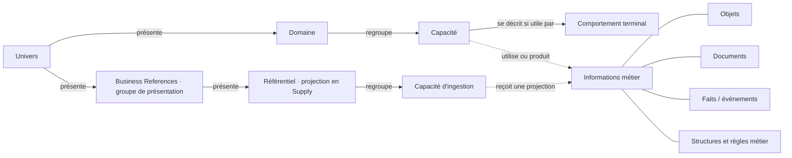

# Atlas — audit UX, UI et architecture de l’information

**19 septembre 2026 · U453/U454, corrigé par U455/U456 · Publication examinée : v010 / 2026-09-19.3**

Audit et propositions de Codex, avec deux décisions de Laurent intégrées depuis : abandon des couches transactionnelle/processus et périmètre strictement métier d’Atlas. Ces principes sont enregistrés dans le backlog ; les autres propositions ne sont pas adoptées par ce document. La publication examinée et l’application restent inchangées. [Maquette interactive](proposition.html) · [Sources et limites d’accès](sources.md) · [Mesures UI](browser-observations.json) · [Inventaire de la publication](model-observations.json) · [Décisions U455/U456 et impacts](../../modeles/backlog/domain-interactions-U455-U456.yaml).

## 1. Avis et décisions recommandées

**Atlas possède une structure métier exploitable. Il doit maintenant mieux faire apparaître les responsabilités, leurs limites et les informations qui passent entre elles.** Son principal défaut n’est pas son manque de couleurs : il demande encore trop de lecture pour trouver la réponse à une question simple.

Le découpage **Univers → Domaine → Capacité** suffit pour la navigation principale. Les comportements restent un détail accessible dans la capacité. Je ne recommande ni un nouveau niveau de domaines, ni l’insertion des données sous les comportements.

Pour l’usage de référence PO/architectes, la carte seule est insuffisante. Elle doit être accompagnée d’une **vue des informations métier** : objets, projections de référence, documents et faits significatifs, reliés aux capacités. Leur sens, leur structure métier, leur autorité et les effets autorisés appartiennent au cadrage. **U456 : Atlas s’arrête à ce périmètre métier.** Les modèles de réalisation, applications, produits logiciels, schémas d’API et mécanismes techniques restent dans d’autres dossiers, sans vue ni liens vers eux dans Atlas. Les architectes s’appuient sur Atlas depuis leurs travaux ; Atlas ne devient pas leur catalogue de solutions.

| Décision | Recommandation | Alternative utile | Compromis |
| --- | --- | --- | --- |
| Structure de lecture | Garder Univers/Domaine/Capacité ; comportements à la demande | Carte toujours entièrement dépliée pour atelier expert | La synthèse devient plus rapide ; un clic supplémentaire ouvre le détail |
| Données | Ajouter une vue transversale d’informations métier dans le même référentiel publié | Enrichir seulement les fiches et le glossaire dans un premier temps | Davantage de contenu à maintenir, mais frontières beaucoup plus explicites |
| Fiches | Afficher résultat, inclus/exclus et voisins avant les développements | Conserver la longue fiche avec un sommaire fixe | La première solution demande une structuration éditoriale ; la seconde corrige surtout la navigation |
| Relations | Montrer d’abord les dépendances directes, avec noms et phrases métier | Graphe complet pour exploration experte | Moins d’informations simultanées, meilleure intelligibilité |
| Couleurs | Fond neutre, texte sombre, marque FLOW, quelques accents expliqués | Monochromie mieux hiérarchisée ; couleurs stables par domaine en mode dédié | Une grammaire légère à apprendre, sans remplacer les libellés |
| Méta modèle | Une vue d’ensemble de sa structure et des exemples, puis le guide existant | Glossaire seul | Un schéma supplémentaire à entretenir, mais un accès beaucoup plus immédiat |

**Ordre de travail conseillé :** lecture et recherche ; fiches de cadrage ; premiers objets et contrats de référence ; puis vues de données et échanges. Une recoloration générale ne résoudrait pas les lacunes de fond.

## 2. Ce qui a été examiné

L’audit combine inspection du code, inventaire de la publication, essais dans Edge sans fenêtre, captures et comparaison documentaire. Les écrans ont été examinés en **1440 × 900**, **1280 × 720** et, pour la fiche d’achat, **390 × 844**. Dix captures de parcours, cinq captures complémentaires et les observations structurées sont conservées dans ce dossier.

La publication a été sélectionnée par **index → descripteur → snapshot**, avec vérification de son SHA-256. Elle contient **138 éléments, 47 capacités, 76 comportements, 6 domaines, 6 référentiels et 338 relations**. Parmi ces relations, **202 sont métier**, les autres décrivent l’appartenance ou la présentation. Les deux glossaires et le guide méthodologique associé à v010 ont été examinés.

Il s’agit d’un **audit expert**, pas d’une étude utilisateurs. Les hauteurs, résultats de recherche, types et contrastes cités sont observés. Les difficultés supposées d’un DG, PO ou développeur sont des risques argumentés à éprouver avec eux ; aucun temps de tâche, taux de réussite ou score de satisfaction n’a été inventé. Les produits du marché ont été comparés sur leur documentation, sans les présenter comme testés en conditions réelles. Aucune conformité WCAG globale n’est revendiquée.

## 3. Ce que dit la discipline d’architecture, indépendamment de SAP

### 3.1 TOGAF : relier deux cartes, sans les confondre

Le **TOGAF Series Guide G190, Information Mapping**, distingue une carte des informations métier d’un modèle de données. Les concepts d’information sont reliés aux capacités ; ils ne se limitent pas aux informations stockables. Le guide les mobilise dans l’architecture métier et comme entrée de l’architecture des systèmes d’information. Cette distinction figure dans les chapitres 4 à 6 de l’édition **avril 2019**, consultée dans une copie du document primaire. Le guide G190 figure également dans la liste officielle des ressources TOGAF de la 10e édition. [G190](https://governance.foundation/assets/frameworks/togaf/g190%20-%20Information%20Mapping.pdf), [liste officielle actuelle](https://help.opengroup.org/hc/en-us/articles/32109993154066-What-Open-Book-Is-Provided-With-the-TOGAF-Enterprise-Architecture-Part-2-Exam).

TOGAF distingue aussi architecture métier, données, applications et technologie. Dans l’édition **9.2** effectivement consultée, la phase C traite les données ; la matrice Data Entity/Business Function rapproche entités et fonctions, tandis qu’une autre matrice rapproche applications et données. Ces deux correspondances sont donc distinctes. La copie consultée est historique ; je ne présente pas ses paragraphes comme une vérification mot pour mot de la 10e édition, dont les chapitres en ligne ont été inaccessibles. [TOGAF 9.2, chapitres 9 et 31](https://governance.foundation/assets/frameworks/togaf/c182e%20-%20TOGAF%209.2.pdf).

**Conséquence pour Atlas — recommandation locale :** conserver la carte des aptitudes, lui relier une carte des informations métier et laisser l’architecture des données approfondir les structures. Il n’est nécessaire ni d’attendre le choix de l’ERP pour parler de données, ni de transformer Atlas en dictionnaire de colonnes.

La séparation pertinente comporte deux axes : **ce que l’on décrit** — responsabilité, information, application — et **avec quel degré de détail**. Un modèle de données conceptuel peut concerner l’entreprise entière ; un modèle logique peut être partagé entre solutions. Le mot « data » ne suffit donc pas à classer un sujet au niveau solution.

### 3.2 Business Architecture Guild : une discipline informationnelle explicite

Le Metamodel Guide v3.0 distingue **Capability**, **Business Object** et **Information Concept**. Son §5.3 relie les concepts d’information aux capacités qui les utilisent ou les modifient ; il explique qu’un modèle IT ne remplace pas la carte des informations métier. Les types, états et relations des concepts participent à cette description. C’est un appui plus direct à la question de Laurent qu’un catalogue de fonctionnalités ERP. [Guild, septembre 2024, §§5.2–5.3.1](https://cdn.ymaws.com/www.businessarchitectureguild.org/resource/resmgr/whitepapers/Business_Architecture_Metamo.pdf).

**Adaptation proposée :** réutiliser les notions déjà présentes dans le glossaire FLOW, en leur donnant des liens et une structure utiles. Ne pas importer la taxonomie complète de la Guild ni créer automatiquement une capacité par objet. La finesse des décisions FLOW reste un choix local assumé.

### 3.3 ArchiMate : distinguer les concepts sans surcharger la lecture

ArchiMate est un langage de représentation ; TOGAF est un cadre et une méthode. Il faut aussi tenir compte des éditions : **ArchiMate 4 a été publié le 27 avril 2026**. La notice officielle indique notamment la suppression de **Representation**, la généralisation d’**Event** et l’ajout de multiplicités de relations. Invoquer aujourd’hui un symbole Representation comme une obligation universelle serait incorrect. La notice a été lue ; la norme complète est restée derrière authentification. [The Open Group, C260](https://publications.opengroup.org/archimate-library/c260).

**Conséquence proposée :** la distinction FLOW entre objet, document et fait peut être conservée pour son utilité métier, sans revendiquer une conformité ArchiMate automatique. Les utilisateurs d’Atlas n’ont pas à apprendre toute une notation d’architecte pour comprendre une commande ou une réservation.

### 3.4 Ce que ces références ne décident pas à notre place

Elles ne fixent pas le propriétaire des données Beaumanoir, les frontières de nos commandes, la cardinalité ligne/engagement, les sources maîtresses de chaque enseigne, ni un découpage logiciel. Elles ne prescrivent pas non plus les trois niveaux de navigation d’Atlas. Ces choix doivent être justifiés par les cas d’usage et les responsabilités métier locales.

### 3.5 Décisions U455/U456 : des responsabilités qui coopèrent, dans une carte métier

La recommandation initiale de conserver un axe transactionnel/processus est retirée. **Les univers et domaines sont en interaction ; les processus peuvent traverser ces responsabilités sans constituer une couche supérieure.** Une capacité de décision ou d’orchestration n’est pas réservée à un étage. L’exemple de Laurent exprime une coopération autour de l’intention, de l’engagement et de sa concrétisation :

Les retours et libellés sont une explicitation proposée de l’exemple ; le diagramme n’adopte ni nouveaux domaines, ni niveaux, ni workflow universel. Business Services n’est pas automatiquement renommé Commerce. Les responsabilités de Process Management et des exécutants restent à leur périmètre actuel.

TOGAF 9.2 décrit des cartes de capacités et de création de valeur complémentaires, ainsi que des modèles de processus : cet appui ne prescrit pas nos deux anciennes couches. Microsoft IOM illustre une coopération entre capture de commandes, orchestration et partenaires d’exécution ; c’est une architecture de produit, pas un découpage FLOW à recopier. [TOGAF 9.2, chapitre 7](https://governance.foundation/assets/frameworks/togaf/c182e%20-%20TOGAF%209.2.pdf), [Microsoft IOM](https://learn.microsoft.com/en-us/dynamics365/intelligent-order-management/overview). L’origine « SAP » des anciennes couches n’est pas établie par cet audit.

**Atlas reste strictement métier (U456).** Il décrit responsabilités, interactions, informations, documents, faits et règles. Les comparaisons éditeurs étayent le travail interne ; les applications, produits logiciels, schémas techniques et liens vers les réalisations restent hors d’Atlas. Les produits/articles de la Supply restent bien des objets métier. La suppression du concept de couche ne supprime pas les distinctions entre décider, s’engager, demander une prestation et constater sa réalisation.

## 4. Comparaison avec le marché : pratiques à reprendre et limites

La comparaison vise les usages d’Atlas, pas l’achat d’un outil EA. Aucun classement global « meilleur produit » n’est établi sans essais, critères pondérés et coûts. Les références sont volontairement de natures différentes.

| Référence | Pratique documentée pertinente | Apport possible à Atlas | Limite / ce qu’il ne faut pas importer |
| --- | --- | --- | --- |
| **SAP LeanIX** | Types distincts pour capacités, applications, interfaces et objets de données ; modèle d’information volontairement peu profond | Relier capacités et informations métier ; générer des vues ciblées depuis les mêmes objets | Les catalogues applicatifs restent hors Atlas (U456). Son Data Object n’est pas un dictionnaire exhaustif ; sa séparation de couches ne dicte pas les niveaux FLOW. [S03–S04](sources.md) |
| **Ardoq** | Entités métier reliées aux capacités et applications ; perspectives et vues adaptées à la question | Une vue « quelles informations utilise cette capacité ? » et sa réciproque | Une entité métier ne doit pas devenir le modèle détaillé de chaque message. Documentation consultée, aucun test UX du produit. [S05–S06](sources.md) |
| **Bizzdesign Horizzon** | Vues filtrées, couleurs selon une propriété, légende permettant de mettre en évidence une catégorie | Une couleur qui répond à une question, accompagnée d’une légende et de filtres | Les vues analytiques expertes ne constituent pas le meilleur écran d’entrée pour tous. [S07](sources.md) |
| **OrbusInfinity** | Vues réutilisables et présentations adaptées aux destinataires, depuis un référentiel commun | Des lectures différentes d’un contenu unique, partageables en comité | Éviter les tableaux de bord de portefeuille lorsque l’objectif est simplement de comprendre le métier. [S08](sources.md) |
| **Microsoft Dynamics 365** | Entités de données qui abstraient les tables pour l’intégration ; catégories de données ; catalogue d’événements métier | Distinguer notion métier, structure d’échange et notification | Un Data Entity Dynamics est un contrat de produit. Un Business Event de la plateforme ne définit pas à lui seul le fait métier FLOW. [S11–S12](sources.md) |
| **Microsoft Azure / DDD** | Délimitation par analyse métier, cohésion, dépendances et modèles contextualisés | Documenter les responsabilités et les échanges avant de choisir les composants | Aucune déduction mécanique domaine = microservice. Un même objet peut avoir des représentations différentes selon le contexte. [S16](sources.md) |
| **Oracle Fusion Procurement** | API Purchase Orders avec lignes, échéanciers et distributions | Éprouver la maille d’une structure d’information et ses variantes | Importer l’ensemble inclurait des détails comptables qui ne sont pas automatiquement dans le périmètre Supply FLOW. [S21](sources.md) |
| **GS1 EPCIS** | Faits de traçabilité contextualisés concernant des objets et leur parcours | Expliciter ce qui s’est passé, sur quoi, quand, où et dans quel contexte | EPCIS couvre la visibilité Supply ; il ne définit pas tous les faits de gestion de l’entreprise. [S15](sources.md) |
| **SAP, méthode et S/4HANA** | Catalogue d’informations dans l’architecture métier ; composants et flux dans l’architecture de solution ; API et documents structurés dans le produit | Confirme une articulation déjà étayée par TOGAF/Guild et les autres outils | Ne pas déduire notre architecture du découpage des modules SAP ni de ses tables. [S01–S02, S13–S14](sources.md) |

**Synthèse de l’analyse, non affirmation de consensus universel :** les références examinées distinguent les responsabilités métier, les informations et leurs réalisations. Les différences portent sur le vocabulaire, les niveaux de détail et les types de relations. Les qualités les plus transposables à Atlas sont la sélection des informations selon la question, les liens explicites entre catalogues et la progression du général vers le détail.

## 5. Diagnostic UX et UI de la publication actuelle

### 5.1 Points solides à préserver

- Un référentiel publié identifié, des versions historiques fixes et un lien de partage qui **fige déjà la version consultée**. Cela sert directement les discussions de périmètre.
- Une hiérarchie courte, des rattachements explicites et un ordre de lecture désormais cohérent : références, concepts transactionnels, puis optimisation.
- Une séparation Carte / Fiche / Relations, des liens directs dans le texte, un fil d’Ariane et une navigation au clavier dans l’arbre.
- Les capacités et comportements sont typés. Les décisions sont positionnées à la fin avec une séparation légère ; les capacités d’ingestion des références gardent leurs icônes spécifiques.
- Les deux glossaires et le guide fonctionnent. Le guide explique déjà la différence entre capacité, réalisation, objet, document et événement.
- Les liens métier sont riches : **202/202 ont un sens explicite ; 194 ont des conditions, 194 des effets et 172 une portée**. Le problème n’est donc pas un graphe vide de sens ; c’est l’accès à ce sens et l’absence d’une dimension informationnelle structurée.

### 5.2 Constats prioritaires, avec preuves

P1 = à traiter pour une V0 de référence ; P2 = amélioration importante ensuite. Aucun P0 bloquant la consultation n’a été observé. La priorité ne prétend pas mesurer une sévérité auprès d’utilisateurs réels.

| ID | Priorité | Constat vérifié | Conséquence probable | Recommandation |
| --- | --- | --- | --- | --- |
| UX01 | P1 | Purchase Order : page **4 928 px** en 1440 × 900 ; titre Périmètre à **y = 1 302**, comparaison marché à **2 493**, rattachement à **4 764** | Les informations permettant de cadrer arrivent tard ; plusieurs écrans de lecture | Synthèse et frontières en tête, détails développables, liens d’ancrage |
| UX02 | P1 | « purchase order » : **24 résultats**, Sales Order avant Purchase Order ; « bon de commande » : **0** ; « commande fournisseur » : **23** | Le lecteur doit connaître le vocabulaire exact puis trier lui-même | Priorité aux noms exacts, alias métier explicites, résultat avec extrait et type |
| UX03 | P1 | La recherche parcourt tous les `fields`, y compris des données internes des comparaisons ; « proposé » retourne **110 éléments** | Résultats sur des contenus que le lecteur ne voit pas ; pertinence dégradée | Indexer les champs destinés au lecteur, avec une politique de pondération explicite |
| UX04 | P1 | La vue autour de Purchase Order montre **17 éléments et 47 relations d’origine** ; l’onglet annonce **14 relations directes** ; à l’échelle initiale les boîtes affichent des IDs | Différence de comptage difficile à expliquer ; le sens métier disparaît au profit des repères techniques | Par défaut, liens directs du centre ; liens entre voisins en option ; noms lisibles ; expliquer les agrégations |
| UX05 | P1 | Zéro objet, document ou événement publié comme élément autonome | Impossible de naviguer directement de l’aptitude aux informations concernées | Une vue informationnelle reliée, sans nouveau niveau dans l’arbre |
| UX06 | P1 | Inclus, exclusions, responsabilités voisines et exemples sont mélangés dans `scope`, parfois sur plus de 500 mots | L’exhaustivité narrative masque les règles à respecter | Structurer les rubriques et garder le texte développé comme référence |
| UX07 | P1 | Certains petits textes ont un contraste insuffisant : fil d’Ariane **3,54:1**, version **3,87:1**, compteur sélectionné **3,19:1** | Repères secondaires difficiles à lire, en particulier en projection ou faible vision | Assombrir les textes secondaires ; garder la légèreté dans les surfaces, pas dans le texte |
| UX08 | P2 | À l’accueil, la carte utilise un grand canevas pour deux univers ; Business Services n’a aucun descendant publié | Beaucoup d’espace avant le premier contenu ; risque de surestimer la couverture d’entreprise | Entrée plus compacte, périmètre Supply explicite, univers non développé présenté sans promesse de couverture |
| UX09 | P2 | Trois gros accès aux glossaires/guide précèdent la recherche et l’arbre | La méthode visuellement plus présente que la découverte du métier | Recherche puis arbre ; aides regroupées dans une zone secondaire accessible |
| UX10 | P2 | Business References affiche « Description non renseignée dans cette publication » | Un élément majeur de lecture ne dit pas à quoi il sert | Une phrase pédagogique publiée expliquant ce regroupement de références |
| UX11 | P2 | Agreement affiche littéralement **« Maîtrise des informations : external »** | Valeur technique, sans source concrète ni portée | Libellé français intelligible puis contrat de projection ; pas de nom de système inventé |
| UX12 | P2 | Deux glossaires séparés, mais TER036/TER037 « Fait de gestion / Document — sens plateforme » restent dans le glossaire métier ; Objet métier est dans le méta | Frontière pédagogique inégale entre notion de modélisation et convention de plateforme | Expliquer les deux sens et relier les entrées ; classement à arbitrer, sans déplacement automatique |
| UX13 | P2 | Sur mobile, Purchase Order atteint **6 646 px** ; pas de débordement horizontal observé | L’adaptation en largeur fonctionne, mais la charge de lecture demeure | Synthèse, sommaire et panneaux de détail ; ne pas refaire le même long document en colonne étroite |
| UX14 | P2 | Univers/domaines/capacités reprennent largement le même vert ; plusieurs icônes abstraites demandent apprentissage | Peu de repères entre familles ; les icônes seules expliquent mal les types | Typographie plus hiérarchisée, libellés accessibles, palette sémantique mesurée |

Preuves : [accueil](01-accueil.png), [univers](02-univers.png), [achat](03-achat.png), [relations d’achat](05-relations-achat.png), [mobile](09-mobile-achat.png), [contrastes](accessibility-observations.json). Références techniques : `BusinessSheet.tsx`, `Sidebar.tsx`, `model.ts::searchModel`, `CytoscapeCanvas.tsx::updateZoomLabels`, `brand.css` dans `app/src`.

### 5.3 Fiche : distinguer la lecture rapide du document de référence

Le bon premier écran doit répondre à quatre questions : **à quoi cela sert, que prend-on en charge, où s’arrête-t-on, avec qui faut-il coopérer ?** Aujourd’hui, la finalité existe, mais le périmètre et les voisins ne sont pas organisés autour de ces questions.

Je recommande une synthèse publiée, et non produite dynamiquement par résumé automatique : une phrase d’action en français sous le nom anglais canonique, trois à cinq responsabilités, les exclusions déterminantes et les liens vers les responsabilités voisines. Le nom Purchase Order reste inchangé ; sa nature de capacité d’action doit être immédiatement lisible.

Les comportements conservent leur place, avec une phrase et le type, puis une ouverture du détail. Depuis U456, les comparaisons éditeurs restent dans le travail interne de justification, hors du parcours métier proposé pour Atlas. La documentation interne de validation demeure interne, conformément à U450.

Une variante moins coûteuse consiste à conserver les champs existants et ajouter un sommaire ancré, en remontant le périmètre avant les comportements. Elle améliore la consultation mais conserve le mélange éditorial. La variante avec rubriques structurées est préférable pour devenir une référence durable.

### 5.4 Recherche : une correction de fond, sans inventer des synonymes

Le moteur actuel cherche des sous-chaînes et conserve l’ordre du modèle. Ainsi, un nom exact ne remonte pas mécaniquement en premier ; « réserver » peut aussi rencontrer « préserver ». Le glossaire n’est pas présenté comme une catégorie de résultats dans la recherche principale.

La recherche proposée prioriserait : nom exact et identifiant ; alias explicitement documentés ; définition et finalité ; périmètre ; éclairages secondaires. Les résultats montreraient le **type**, le **rattachement** et l’**extrait expliquant la correspondance**. « Bon de commande » doit conduire d’abord à la notion de document appropriée, puis à la capacité associée ; ce n’est pas un synonyme à injecter aveuglément dans Purchase Order.

Une recherche assistée par IA n’est pas prioritaire. Avant cela, des libellés stables, un index public propre et quelques variantes lexicales validées auront un effet plus prévisible. Préserver les accents tolérés, Ctrl K, la recherche par ID et les liens profonds existants.

### 5.5 Relations : faire lire des responsabilités, puis explorer le réseau

Le graphe actuel offre déjà niveaux, profondeur, filtres, disposition et liste accessible. Ces mécanismes sont utiles pour un architecte. Mais une première vue montrant des codes D04.j/D07.b oblige à mémoriser le catalogue.

Pour une capacité, proposer d’abord deux listes ou colonnes : **« A besoin de »** et **« Est utilisée par »**, avec noms et phrases. Le graphe reste un autre mode de visualisation de ces mêmes relations. Les liens entre voisins, la profondeur supérieure et la totalité du modèle viennent ensuite. Pour une vue d’ensemble, commencer au niveau domaines/référentiels, pas avec toutes les capacités et tous les croisements.

La flèche actuelle `needs` va du demandeur vers ce dont il a besoin. **Ce n’est pas le sens d’un flux de données.** Une vue d’échange doit définir son propre sens fournisseur → consommateur et son objet échangé. On ne doit pas simplement recolorer les mêmes flèches et les rebaptiser « flux ».

### 5.6 Glossaires et méta modèle

Le défaut antérieur d’ascenseur ne doit pas être répété dans le rapport comme s’il était toujours avéré. L’implémentation actuelle a deux zones de défilement bornées ; sélectionner un terme ramène sa description en haut et lui donne le focus. L’essai complémentaire vérifie ce mécanisme. Il reste à apprécier sa compréhension avec des lecteurs, notamment sur mobile, où une liste suivie d’une description est souvent plus naturelle qu’une succession de petites zones à faire défiler.

Les deux glossaires doivent rester distincts mais reliés. Depuis une fiche, ouvrir d’abord une définition courte dans le contexte, puis donner accès à l’entrée complète. Un guide compact avec exemples est utile ; les six leçons existantes sont à conserver. Il lui manque surtout **une vue d’ensemble qui montre toutes les catégories ensemble et la différence entre hiérarchie, présentation et liens**.

### 5.7 Accessibilité et lisibilité

Les paires de couleurs citées ont été calculées à partir des styles CSS, hors fonds complexes et transparences d’ancêtres. Les écarts concernent des repères textuels visibles, pas une condamnation de toute la palette. Le texte ordinaire requiert normalement 4,5:1 ; la couleur ne doit pas être le seul porteur du sens. [W3C 1.4.3](https://www.w3.org/WAI/WCAG22/Understanding/contrast-minimum.html), [W3C 1.4.1](https://www.w3.org/WAI/WCAG22/Understanding/use-of-color.html).

Le texte de l’arbre est à 12 px, plusieurs repères à 9–11 px. Ce n’est pas, à lui seul, un échec WCAG ; c’est une faiblesse probable en présentation collective. Viser 14–16 px pour la navigation/lecture essentielle et tester le zoom à 200 %. Les commandes de l’arbre demandent aussi une vérification des zones cliquables et du focus. Le minimum WCAG de 24 px comporte des exceptions, à examiner sur la cible réelle et son espacement. [W3C 2.5.8](https://www.w3.org/WAI/WCAG22/Understanding/target-size-minimum.html).

Ctrl K fonctionne dans l’essai, aucun plantage JavaScript n’a été observé sur les parcours capturés et la fiche mobile ne déborde pas horizontalement. Le lecteur d’écran, les contrastes du canevas, tous les états de focus/survol et le zoom navigateur complet restent à tester avant d’affirmer une conformité.

## 6. La dimension données : contenu à ajouter et frontière à respecter

### 6.1 La frontière est le sens métier, pas l’absence de données

Le tableau suivant applique U456. Il distingue ce qu’Atlas décrit de ce que les dossiers de solution élaborent à partir de cette référence ; il ne crée ni couches métier ni navigation d’Atlas vers des produits.

| Profondeur | Question | Contenu utile | Où le présenter ? |
| --- | --- | --- | --- |
| **Information métier** | De quoi parle-t-on et qu’est-ce que cela signifie ? | Objet, identité et portée métier, états significatifs, liens, responsabilités, informations nécessaires, faits/documents associés | Dans Atlas, par fiches liées aux capacités et glossaire |
| **Structure métier** | Comment ces informations s’articulent-elles et quelles règles doivent-elles respecter ? | Structure conceptuelle, cardinalités métier justifiées, unités, temporalité, autorités, qualité et cohérence attendues | Dans Atlas, à la profondeur nécessaire pour comprendre le métier |
| **Réalisation des données et solutions** | Comment des systèmes représentent-ils, stockent-ils et échangent-ils ces informations ? | Modèles logiques/physiques d’implémentation, schémas API/messages, attributs techniques, formats, tables, protocoles, stockage et reprises | Hors d’Atlas, dans les dossiers de réalisation, sans lien sortant proposé dans Atlas |

La frontière dépend du **sens de la décision**, pas du simple fait qu’il existe un attribut. « La quantité est exprimée dans une unité identifiée » est une règle métier utile. `decimal(18,6)` relève d’un choix de représentation. « Une confirmation peut concerner une partie d’une ligne » peut changer le métier et les frontières ; le nom d’une colonne ne le fait pas.

Atlas doit décrire des **types d’objets et de faits**, pas devenir un explorateur des commandes et réceptions réellement enregistrées. Une donnée d’exemple clairement fictive peut rendre le sens concret sans introduire de données d’exploitation.

### 6.2 Une capacité ne devient pas un objet parce que son nom est un nom commun

Dans le modèle courant, **Purchase Order D04.j est une capacité d’action**, conformément au choix de nommage antérieur. L’objet Purchase Order est déjà défini dans le vocabulaire métier, mais n’est pas un nœud informationnel publié autonome. Cette homonymie est gérable si l’interface affiche toujours le type et le rôle.

Exemple de distinction proposée :

| Élément | Question à laquelle il répond | Exemple |
| --- | --- | --- |
| Capacité Purchase Order | Que sait faire l’entreprise ? | Prendre en charge les achats et suivre ce qui reste à satisfaire |
| Objet Purchase Order | Quelle demande d’achat maintient-on ? | Une commande identifiée, son contexte et ses attentes |
| Structure métier | Comment se composent les attentes ? | Lignes, produit ou prestation, quantité/unité, destination, dates |
| Document associé | Quelle expression identifiée est produite ou reçue ? | Bon de commande, confirmation fournisseur |
| Fait associé | Qu’est-il arrivé, et avec quel effet ? | Une confirmation a été reçue ; une quantité a été réceptionnée |
| Contrat de solution — hors Atlas | Comment un logiciel représente-t-il ces informations ? | Ressource API, schéma d’événement ou document structuré |

Ces exemples n’établissent aucune cardinalité, immutabilité générale ni frontière d’agrégat. Les mêmes principes s’appliquent à Product Reference : la projection de référence, l’aptitude à la recevoir et les concepts Product/Product Variant/Product Unit sont trois responsabilités descriptives différentes.

### 6.3 Le minimum utile d’une fiche d’information métier

Je propose un noyau court, avec détails facultatifs selon le bénéfice :

1. **Sens et périmètre** : ce que représente l’objet, ses variantes pertinentes et ses exclusions.
2. **Identité et maille** : produit/variante/unité, commande/ligne, stock à quelle maille ; contexte nécessaire pour distinguer deux instances.
3. **Informations essentielles** : quelques familles compréhensibles, avec unités, dates et sens des valeurs ; pas toutes les colonnes d’un ERP.
4. **Relations** : objets référencés et cardinalités seulement lorsqu’elles sont établies et utiles.
5. **Responsabilités** : qui détermine une information, qui la tient, qui la reçoit, qui la consulte ; plusieurs autorités possibles selon les familles d’information.
6. **États, règles et effets** : invariants importants et faits/documents qui les établissent ou les modifient.
7. **Exemples métier** : un cas concret montrant comment interpréter la structure et ses règles, sans contrat logiciel ni réalisation liée.

Un exemple concret peut remplacer plusieurs paragraphes. Le détail doit répondre à une ambiguïté réelle ; il n’est pas nécessaire de documenter toutes les rubriques au même niveau pour tous les objets.

### 6.4 Référentiels : expliciter la projection et son alimentation

Les six référentiels décrivent leurs informations en prose. Le champ `mastership` n’est présent que sur quatre, avec une forme hétérogène. Il n’existe pas de contrat structuré décrivant la source d’alimentation et l’autorité par information. Les définitions de Product Reference et Fulfillment Network ne doivent pas être interprétées comme une autorisation d’administration maîtresse locale.

| Aspect du contrat de projection proposé | À préciser au niveau métier | À laisser au dossier de solution |
| --- | --- | --- |
| Autorité | Quelle responsabilité externe fait foi, pour quelle information et quel contexte ? | Application effectivement choisie/configurée, si elle n’est pas déjà établie dans l’existant |
| Source d’alimentation | Qui fournit quelle information, directement ou via un intermédiaire ? | Connecteur, endpoint, transport et routage |
| Identité | Comment reconnaître le même produit, partenaire, accord ou lieu entre contextes ? | Clés physiques et algorithmes de correspondance |
| Portée | Enseigne, entité, pays, canal ou autre contexte métier pertinent | Partition technique et implantation physique |
| Actualité | Quelle fraîcheur est nécessaire, quelle date d’effet fait foi ? | Planification des traitements, cache et mécanisme de synchronisation |
| Évolutions | Que signifient une correction, une fin de validité ou une disparition ? | Rejeu, reprise et gestion technique des tombstones |
| Qualité | Que faire métier si une référence manque, est contradictoire ou trop ancienne ? | Codes d’erreur, supervision et tentatives automatiques |

**Source maîtresse ≠ source d’alimentation ≠ source documentaire de l’audit.** Un intermédiaire peut transmettre une information sans en être l’autorité. Une projection peut combiner plusieurs sources ; il faut alors préciser la règle de priorité, pas désigner un maître universel par commodité.

Aucune application source Beaumanoir n’est nommée par cet audit. Si une autorité n’est pas encore connue, il faut conserver ce manque dans le travail d’architecture et ne pas présenter une source supposée comme une vérité. Cela n’impose pas le retour des statuts et réserves éditoriales dans Atlas ; une limite de connaissance qui change l’usage métier doit être formulée comme telle, dans le contenu approprié.

### 6.5 Trois options d’intégration de la data

| Option | Avantage | Limite | Avis |
| --- | --- | --- | --- |
| **A — Enrichir uniquement les textes et le glossaire** | Rapide, peu d’évolution de schéma/UI | Répétitions, liens difficiles à parcourir, peu de contrôle des incohérences | Transition acceptable pour quelques fiches |
| **B — Petit catalogue d’informations métier relié aux capacités** | Responsabilités, structures essentielles et usages navigables ; même publication | Demande des relations et contrats éditoriaux propres | **Recommandé pour Atlas** |
| **C — Catalogue de données/solutions externe relié depuis Atlas** | Donne accès au détail de réalisation | Fait déborder Atlas de son périmètre métier | **Option retirée par U456** ; les dossiers spécialisés restent indépendants |

B est recommandé ; A permet une première étape. Les dossiers spécialisés peuvent utiliser les identifiants et définitions d’Atlas depuis l’extérieur, sans vue de solutions ni navigation de réalisation dans Atlas. La cohérence sémantique n’exige pas l’uniformité des structures logicielles.

## 7. Documents et faits de gestion : oui dans Atlas, avec une maille métier

### 7.1 Le besoin a déjà été posé dans FLOW

La [note existante sur capacités, objets et faits](../../connaissance/24-capacites-objets-et-faits.md) propose déjà objets concernés, informations nécessaires, résultats/états, faits, documents, règles et autorités. La publication contient les termes **TER036** et **TER037**, avec un sens explicitement qualifié de « plateforme ». Le guide pédagogique montre aussi une commande, un bon de commande et une commande expédiée.

**Le manque actuel est donc surtout un passage incomplet de l’intention au modèle publié et à son affichage.** Quatre nœuds illustratifs existent dans le backlog ; ils sont exclus de la publication. Ils ne peuvent pas servir de catalogue métier validé par simple réintégration.

### 7.2 Les distinctions utiles

La grille suivante est proposée pour la clarification ; elle ne remplace pas les définitions historiques.

| Notion | Sens utile | Exemple | Confusion à éviter |
| --- | --- | --- | --- |
| **Objet métier** | Une chose sur laquelle on raisonne et dont on suit l’identité ou les propriétés | Commande d’achat, engagement de satisfaction | Table, microservice ou fichier |
| **État** | Une situation applicable à un instant, éventuellement sur plusieurs dimensions | Commande autorisée ; quantité restant à satisfaire | Fait ponctuel ou statut unique censé tout résumer |
| **Document métier** | Une expression identifiée d’informations, avec un usage et des règles de version/correction | Bon de commande, confirmation fournisseur, justificatif de réception | Tout document serait un PDF ; tout document ERP serait immuable |
| **Fait de gestion** | Ce qui a été constaté ou accompli, avec sa portée et ses conséquences métier | Une réception a été enregistrée pour une quantité donnée | Demande d’action, calcul possible ou simple changement technique |
| **Événement métier communiqué** | Une notification portant le sens d’un fait/changement utile à d’autres responsabilités | Information qu’une confirmation fournisseur est disponible | Le message de transport serait le fait lui-même |
| **Message technique — hors Atlas** | Une représentation transmise selon un contrat de solution | Notification JSON, échange EDI, appel de service | Tout échange prouverait une réalisation physique ou un engagement |

Dans FLOW, TER036 associe le fait de gestion à un document. **Il faut conserver cette convention tant qu’elle n’est pas réexaminée**, et préciser si elle concerne tous les événements métier ou seulement une catégorie de faits documentés. Le marché ne permet pas d’imposer une équivalence générale fait = document = message. La relation exacte et les règles de correction sont un arbitrage métier, pas une simple amélioration d’icône.

Microsoft décrit des notifications issues d’actions métier et distingue ce mécanisme de l’export de données. GS1 décrit des événements de traçabilité contextualisés. Ces deux approches éclairent des besoins différents ; aucune ne prouve qu’un fait métier FLOW doive avoir un message ou un document unique. [Microsoft](https://learn.microsoft.com/en-us/dynamics365/fin-ops-core/dev-itpro/business-events/home-page), [GS1](https://support.gs1.org/support/solutions/articles/43000755325-what-is-electronic-product-code-information-services-epcis-).

### 7.3 Ce qui doit être dans la carte et dans les dossiers de solution

Dans Atlas : type de document/fait, signification, objets concernés, responsabilité qui l’établit ou le reçoit, moment métier, conditions et effets, liens avec les autres capacités. Également, lorsqu’ils changent le sens métier : distinction date de survenance/date de connaissance, portée partielle, correction, référence au document antérieur et origine du constat.

Dans l’architecture de données ou la solution : schéma détaillé, identifiants techniques, sérialisation, stockage, ordre de livraison des notifications, reprise et déduplication technique. L’exigence métier « un même constat ne doit pas être comptabilisé deux fois » peut être dans Atlas ; le mécanisme d’idempotence relève du contrat de réalisation.

Ces contenus sont accessibles **depuis les capacités et une vue d’informations**. Ils ne deviennent pas des sous-capacités ni des enfants des comportements. Un document n’est pas nécessairement un fichier ; « document » dans un ERP peut aussi désigner un enregistrement structuré, comme le Material Document SAP. Cela n’adopte pas sa sémantique dans FLOW. [SAP, exemple produit](https://help.sap.com/docs/SAP_S4HANA_ON-PREMISE/eb2a39dd0c124fed8252f684002d55e1/8bb0d08295044ee3af444b4f2a6e4457.html).

### 7.4 Quand créer une fiche autonome ?

Créer une fiche si la notion traverse plusieurs capacités, porte une autorité propre, produit un effet important, ou suscite une ambiguïté de scope. Sinon, un exemple ou une précision dans une fiche existante suffit. Cela évite un catalogue disproportionné de documents, de champs et de micro-événements.

Pour démarrer, éprouver **Purchase Order**, **Product/Product Variant**, **Fulfillment Commitment**, **Reservation**, puis un fait de réception et un document de confirmation. Ce sont des candidats d’atelier à rapprocher des termes existants, pas six créations adoptées. Choisir quelques cas complets et compréhensibles vaut mieux que créer trente coquilles vides.

## 8. Complétude du méta modèle : ce qui manque réellement

### 8.1 Distinguer intention, contenu publié et présentation

| Sujet | Contrat / intention actuelle | Publication / UI actuelle | Diagnostic |
| --- | --- | --- | --- |
| Univers | `group_role` et `level_ref` représentent le niveau | Deux univers visibles | Suffisant ; rendre la couverture réelle explicite |
| Domaine | Type distinct, responsabilités regroupées | Six domaines sans domaines imbriqués | Conserver |
| Capacité → Comportement | Types, parent explicite, terminalité, justification de décomposition | 47 capacités / 76 comportements | Socle cohérent ; détail à révéler progressivement |
| Business References | Groupe de présentation, pas domaine supplémentaire | Affiché comme tel ; description absente | Explication courte à publier |
| Référentiel / capacité d’ingestion | Éléments de natures différentes, reliés | Six référentiels avec leur capacité d’ingestion | Distinguer clairement données reçues et aptitude à les recevoir |
| Types de capacités et comportements | Six natures de capacités, sept formes de comportements | Icônes associées ; exceptions d’icônes pour les références | Ajouter une légende contextuelle, sans nouveau type métier |
| Anciennes couches transactionnelle/processus | Axe retiré par U455 | v010 conserve 137 marqueurs transactionnels et un marqueur processus | Héritage technique à migrer ; ne plus enseigner cette séparation ni en déduire des frontières |
| `contains` / `presents` / dépendances | Relations distinctes | Arbre et graphes séparés | Bon principe ; rendre le sens des flèches immédiat |
| Objet / document / événement | Types autorisés par le schéma, guide pédagogique existant | Zéro nœud de ces types publié | Manque de contenu et de parcours, pas absence totale de concepts |
| Structure des informations | Quelques éléments en prose | Pas de structure ou cardinalités navigables | Contrat et UI à étendre de façon ciblée |
| Projection de référence | Décrite dans les définitions | `mastership` partiel et non structuré | Autorités et alimentation insuffisamment explicites |
| Inclusions / exclusions / invariants | Décrits dans `scope` et dans les relations | Mélangés dans les développements | Structuration éditoriale nécessaire pour le cadrage |
| Réalisation et couverture | Hors périmètre Atlas selon U456 | Quelques comparaisons éditeurs sont encore visibles dans v010 | Conserver ces travaux dans les dossiers internes/solutions ; aucune vue de produits ni réalisation liée dans Atlas |
| Deux glossaires | Guide et classification versionnés | Séparation fonctionnelle ; conventions de document/fait encore ambiguës | Clarifier les sens et les renvois, préserver les identifiants |

**Le schéma permet déjà `object`, `document`, `event`, mais pas les nouveaux champs structurés suggérés ci-dessus.** Les `fields` autorisés sont aujourd’hui nom, définition, finalité, périmètre, nature, indépendance, maîtrise, justification de décomposition et comparaisons marché. Une extension informationnelle propre demande donc une évolution de contrat, de validation et de publication ; elle ne se résume pas à ajouter des cartes React.

### 8.2 Vue d’ensemble recommandée pour « Comprendre le méta modèle »

Schéma **pédagogique proposé**, pas nouvelles relations canoniques. Les regroupements du bas ne sont pas des niveaux de l’arbre. La nature de capacité et la forme de comportement restent des **axes de qualification**, pas des emboîtements supplémentaires. L’axe de couche est supprimé par U455. Une capacité ne devient pas une décision par la seule présence d’un calcul ; les règles actuelles de responsabilité dominante restent applicables.

### 8.3 Modifications de contrat à prévoir si l’extension est retenue

Une implémentation future devra relier les fiches d’information au glossaire canonique, définir les familles de relations et leurs extrémités admissibles, puis contrôler les références orphelines, la version des structures liées et les autorités contradictoires. Les cardinalités d’instances doivent être distinguées des cardinalités des relations dans le catalogue.

Il faut aussi une séparation explicite entre texte destiné au lecteur et métadonnées internes. `publicText.ts` retire actuellement des phrases éditoriales connues par expressions régulières. C’est une mesure de présentation, fragile face à de nouvelles formulations. Une prochaine évolution du contrat devrait publier une projection de lecture maîtrisée, avec tests, au lieu d’accumuler des règles de suppression. Les snapshots historiques et leurs preuves resteraient inchangés ; une correction publiée passerait par une nouvelle version.

## 9. Comment Atlas peut réellement cadrer les PO et les architectures

### 9.1 Le contrat de lecture d’une capacité

Pour évaluer une fonctionnalité proposée, un PO doit pouvoir retrouver : le résultat métier auquel elle contribue ; le périmètre où elle s’applique ; la règle qui l’autorise ou la limite ; les objets concernés ; les capacités voisines dont elle dépend. L’absence d’une fonctionnalité nommée dans Atlas ne prouve pas automatiquement qu’elle est hors périmètre : une capacité est plus stable et plus large qu’un catalogue de fonctions.

Une proposition doit être **rattachable et justifiable**, et non simplement ressembler au nom d’une carte. Si elle change la responsabilité, l’autorité sur les données, les engagements ou les effets permis, elle appelle un arbitrage métier. Si elle change seulement la forme d’un écran ou un mécanisme technique dans les limites établies, elle reste du ressort de la solution.

| Proposition à examiner — exemples de raisonnement | Lecture attendue dans Atlas |
| --- | --- |
| Un produit Supply veut administrer le maître des partenaires | Comparer avec Party / Role, projection externe ; ce serait un changement d’autorité à arbitrer |
| Une affectation rend une ressource indisponible aux demandes concurrentes | Contradiction avec la frontière adoptée : **seule Reservation bloque**, Supply Assignment seul ne bloque pas |
| Le composant d’optimisation modifie directement une commande | Vérifier la séparation décision / application autorisée et la responsabilité d’Order Management |
| Une fonction exécute un remboursement dans le périmètre Supply | La frontière Commerce/Finance reste externe à Supply ; un besoin d’attendre son résultat ne transfère pas sa responsabilité |
| Deux capacités sont réalisées dans une même application | Ce n’est pas une raison suffisante pour fusionner les capacités ; examiner leurs contrats et responsabilités |

Ces cas illustrent la valeur de la carte comme référence. Ils ne constituent ni un nouveau catalogue de règles ni une validation d’une solution particulière.

### 9.2 Identifier des possibilités de découplage

Les frontières Univers/Domaine/Capacité constituent des repères de discussion. Pour décider où découpler, les architectes ont ensuite besoin de comprendre **quelle information traverse la frontière, qui fait autorité, quel effet est demandé et quelle cohérence temporelle est nécessaire**.

| Question de découplage | Apport attendu d’Atlas | Travail restant de solution |
| --- | --- | --- |
| Responsabilité autonome ? | Résultat et limites propres, invariants métier | Répartition en composants, équipes et livraisons |
| Qui est autorisé à modifier quoi ? | Autorité métier, commande autorisée, effet attendu | API, droits techniques et contrôle transactionnel |
| Que peut-on connaître avec retard ? | Fraîcheur tolérable et conséquence métier d’une information ancienne | Synchrone/asynchrone, cache, réplication et cohérence distribuée |
| Qu’est-ce qui doit rester cohérent ensemble ? | Invariants et engagements indivisibles du point de vue métier | Agrégats, transactions et stratégie de compensation |
| Quel fait peut être communiqué sans imposer un traitement ? | Sens du fait, contexte, consommateurs potentiels | Événement d’intégration, contrat, abonnements et livraison |
| Que faire en cas de réponse absente ou contradictoire ? | Résultat acceptable, suspension ou arbitrage attendu | Temporisation, reprise, supervision et mécanismes de secours |

**Aucun trait de la carte ne devient automatiquement une frontière de microservice.** La dépendance fonctionnelle reste compatible avec plusieurs réalisations. Le choix technique doit rendre compte du métier et des contraintes d’exploitation. L’appui DDD de Microsoft va dans ce sens sans imposer une architecture microservices à FLOW. [Analyse de domaine](https://learn.microsoft.com/en-us/azure/architecture/microservices/model/domain-analysis).

### 9.3 Une référence commune, plusieurs lectures

Je recommande des vues nommées par leur question — **Comprendre**, **Périmètre et règles**, **Informations et échanges** — plutôt qu’un sélecteur « DG / PO / Développeur » qui enfermerait les personnes dans un niveau d’accès intellectuel. Tous peuvent approfondir le même objet.

Pour une V0 légère, les deux premières peuvent être réunies dans une fiche synthétique, avec détails repliables. C’est l’option illustrée dans la maquette. Les vues plus spécialisées ne doivent pas produire plusieurs descriptions concurrentes : elles sélectionnent des champs du même contenu versionné.

## 10. Couleurs et composition visuelle

### 10.1 La monochromie est-elle une mauvaise décision ?

**Elle est défendable pour la sobriété et l’identité, mais elle ne suffit pas à hiérarchiser un contenu dense.** Le vert FLOW est pertinent pour la marque, la sélection et les actions. L’utiliser aussi pour presque tous les titres, pictogrammes et liens atténue ces différences. Le remède principal est d’abord la composition, les tailles et les espacements.

La charte existante contient déjà menthe, lavande, sable et pêche. Il n’est pas nécessaire d’inventer une nouvelle identité. Fluent 2 distingue palettes neutres, de marque et sémantiques ; Fiori distingue également équilibre de marque, accents et états. Ces principes justifient l’usage parcimonieux de couleurs, pas l’adoption de leurs palettes. [Fluent](https://fluent2.microsoft.design/color), [Fiori v1-145](https://www.sap.com/design-system/fiori-design-web/v1-145/foundations/visual/colors-overview).

| Option | Ce que le lecteur gagne | Risque | Recommandation |
| --- | --- | --- | --- |
| **A — Monochromie mieux composée** | Sobriété, continuité maximale, moins de codes | Familles moins faciles à repérer | Acceptable si la densité et les contrastes sont corrigés |
| **B — Fond neutre + accents utiles** | Références, informations et faits repérables ; lecture calme | Nécessité d’une légende stable | **Préférée** |
| **C — Une couleur par domaine** | Orientation spatiale et mémorisation du domaine | Palette croissante, confusion avec types, sélection et statuts | Variante de carte ou d’atelier, pas code universel de toutes les fiches |

Dans B : texte sombre ; vert pour interaction/sélection ; sable pour les références ; lavande pour l’information ; pêche pour les documents/faits lorsqu’ils sont présentés. Ces familles sont illustratives, à tester. Les types de capacités et comportements restent identifiés par les icônes demandées et des libellés accessibles. Une couleur ne doit pas coder simultanément un domaine, une nature de capacité et un état de validation.

Il ne faut pas importer des heatmaps de maturité rouge/orange/vert sans objet d’analyse précis. Elles suggéreraient une évaluation qui n’est ni l’objectif de compréhension ni un contenu établi. Les réserves et validations internes ne reviennent pas sous forme de couleurs.

### 10.2 Carte et fiches : quatre règles de composition

1. **Carte générale compacte.** Une phrase de finalité par domaine, pas des paragraphes tronqués uniformément ; les capacités se découvrent au niveau suivant ou via une vue développée explicite.
2. **Ordre de lecture conservé.** Référentiels d’abord, puis responsabilités de base, puis optimisation. Ce parcours pédagogique n’est pas dessiné comme une séquence d’exécution.
3. **Décisions toujours en fin de domaine.** Conserver le trait léger et lui donner une explication accessible ; ne pas compter uniquement sur sa couleur ou sa position.
4. **Détail à la demande.** L’essentiel est visible, les développements restent atteignables par une action claire. Ce principe relève de la divulgation progressive, à valider sur les tâches d’Atlas. [NN/g](https://www.nngroup.com/articles/progressive-disclosure/).

La [maquette](proposition.html) permet de comparer A/B/C et de basculer entre une fiche de cadrage et une vue des informations. Son contenu est illustratif, ses deux vues ne sont pas branchées sur Atlas. Les autres éléments de navigation servent de contexte visuel et ne sont pas des fonctions promises.

## 11. Trajectoire de V0 et critères de réception

### Lot 1 — rendre la lecture directe

Travaux UI : améliorer les contrastes ; afficher les noms dans les graphes d’entrée ; hiérarchiser les résultats de recherche ; exclure de son index les annotations internes ; rapprocher la recherche de l’arbre ; ajouter la synthèse et le sommaire des fiches. Conserver les liens figés, le partage, les deux glossaires et l’ordre des décisions.

Travaux éditoriaux associés : phrase de présentation de Business References, libellé français pour la maîtrise externe, exemples courts et périmètres organisés sur quelques fiches pilotes. **Aucun résumé affiché ne doit modifier une exclusion ou transformer une hypothèse en règle.**

### Lot 2 — éprouver le cadrage sur quelques cas complets

Traiter Purchase Order et Product Reference, puis le triptyque **Fulfillment Commitment / Supply Assignment / Reservation**. Pour chaque cas : responsabilités, inclus/exclus, informations essentielles, dépendances et exemples de propositions conformes ou à arbitrer. Ces cas concentrent les risques de confusion soulevés par Laurent.

Faire relire aux experts les autorités, grains d’information, états et effets avant de généraliser des champs. Les futures exigences de données doivent enrichir les contrats sans rouvrir automatiquement l’audit clos des comportements.

### Lot 3 — publier la vue informationnelle

Étendre le schéma et les validations pour les structures retenues, relier les objets au glossaire, qualifier les usages et projections, puis ajouter les parcours UI. Le snapshot devra inclure les éléments et liens nécessaires à sa lecture ; une version historique ne récupérera pas une structure de données vivante du backlog.

Les structures métier sont publiées avec leur sens et leurs règles. Les schémas et dossiers de solution demeurent hors d’Atlas ; ils peuvent citer une version d’Atlas pour expliciter leur référence métier.

### Critères proposés pour déclarer la V0 présentable

Ce sont des objectifs de réception à confirmer par des essais, pas des performances déjà atteintes ni des seuils normatifs d’UX.

| Lecteur et tâche | Réussite attendue |
| --- | --- |
| Direction : expliquer ce que couvre Supply et ce que distingue Promising d’Optimization | Réponse correcte sans devoir lire les comparaisons éditeurs ; cible exploratoire de 2 minutes |
| Métier : retrouver une commande d’achat à partir de « achat » ou « bon de commande » | Résultat ou renvoi pertinent dès le premier groupe de résultats ; distinction capacité/document comprise |
| PO : qualifier une proposition d’administration locale d’un référentiel | Retrouve la limite d’autorité et la responsabilité voisine ; ne conclut pas sur le seul nom de la carte |
| PO : expliquer l’effet de Supply Assignment et Reservation | Identifie sans ambiguïté ce qui bloque les usages concurrents |
| Architecte solution : examiner le découplage achat/référentiels/réalisation | Identifie informations échangées, responsabilités et questions de cohérence ; aucune bijection avec des microservices déduite |
| Développeur : trouver la définition d’une information et sa structure métier | Accède au même sens et à une version identifiable ; retrouve les règles métier, sans chercher un contrat technique dans Atlas |
| Tous : consulter un terme long et revenir à la capacité | Pas de perte de sélection ni confusion sur le panneau qui défile |
| Clavier et faible vision | Parcours essentiels utilisables, focus visible, contrastes corrigés, lecture au zoom testée |

Un atelier de **6 à 8 personnes**, couvrant direction, métier, PO et architecture/développement, peut fournir une première observation qualitative. Faire exécuter des tâches sur l’Atlas courant puis la proposition ; relever réussites, hésitations et mots utilisés. Un tel échantillon n’établit pas une représentativité statistique. Les corrections doivent être fondées sur les difficultés observées, pas sur un score esthétique global.

## 12. Arbitrages qui restent réellement métier

L’audit recommande une direction mais ne tranche pas les sujets suivants sans les experts :

- Le périmètre exact de la convention **fait de gestion associé à un document**, et sa relation aux autres événements métier.
- Les autorités et sources d’alimentation réelles des six projections, par contexte et famille d’information.
- Les structures et cardinalités qui changent les engagements : lignes, échéanciers, confirmations partielles, groupement/fusion, historique et corrections.
- Les invariants qui exigent une cohérence immédiate, et les tolérances métier à une information différée.

Le choix recommandé pour lancer la suite est **B : un petit catalogue d’informations métier relié aux capacités**, avec **la palette B et une fiche synthétique avant le détail**. Les sujets complexes ci-dessus doivent être présentés sur des cas concrets pour arbitrage. Aucune consultation supplémentaire n’est nécessaire pour terminer cet audit.

## 13. Livrables, contrôles et modifications de ce travail

**Audit initial U453/U454 :** création du rapport, du registre de sources, de la maquette, des scripts d’observation et de leurs captures/mesures ; enregistrement des contributions et rapprochements de marché. À cette étape, modèle métier, publications, schémas et code d’Atlas n’avaient pas été modifiés.

Les empreintes des **120 fichiers protégés lors de l’audit initial U453/U454** sont conservées dans [protected-files.json](protected-files.json). Les vérifications initiales et limites sont consignées dans [verification.json](verification.json). Ces preuves décrivent l’état avant les corrections U455/U456, pas le backlog courant.

**Complément U455/U456 :** principes et limites du backlog, conventions, instructions et proposition d’audit corrigés ; maquette recentrée sur le métier. Les nœuds, relations, publications et code d’Atlas restent inchangés. La migration du champ historique `layer`, des formulations héritées et des parcours produits est identifiée dans l’annexe de décision, sans être présentée comme réalisée. [Contrôles du complément](../2026-09-19-atlas-scope-U455-U456/verification.json). Pas de release, de commit ou de push au titre de ce travail.
