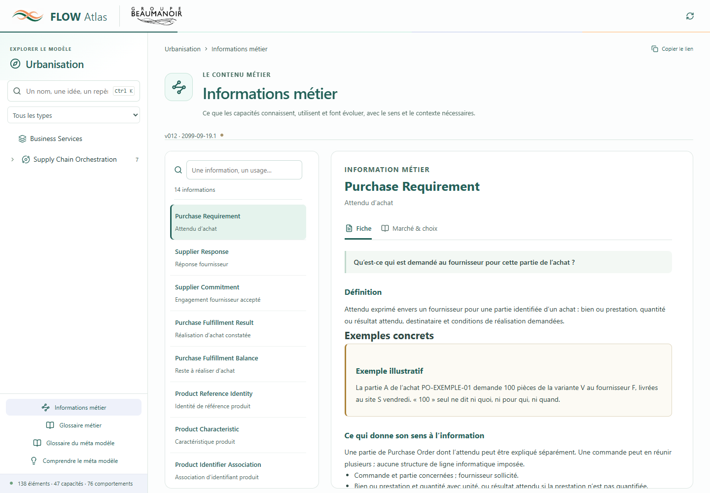

# U468 — Les informations métier deviennent consultables dans Atlas

19 septembre 2026. Lot 4 du plan U458 implémenté et testé. **Aucune release produite : v011 / 2026-09-19.4 reste courante.**

La demande « Prochaine étape » poursuit l’intégration des fiches préparées au lot précédent. Le nouveau catalogue est prêt à entrer dans le snapshot d’une prochaine publication. Les captures ci-dessous utilisent un candidat isolé, daté volontairement `2099-09-19.1` ; ce n’est pas une publication disponible sur le serveur.

## Ce qui change pour le lecteur

- Une entrée **Informations métier** donne accès aux 14 fiches, avec recherche locale et index anglais/français.
- La fiche présente une question métier, une définition et un exemple concret, puis le contexte, les éléments qui portent ensemble le sens, les limites et la distinction avec les faits/documents.
- Les usages nomment les capacités concernées et expliquent leur rôle. Les 15 liens entre informations donnent leur sens, leur condition et leur effet.
- L’onglet **Marché & choix** conserve les raisons du terme et de la définition, les différences avec les références et les liens directs vers les sources primaires consultées au pilote. Il contient 16 rapprochements documentaires, pas 16 standards ni 16 sources uniques.
- Les fiches des capacités, domaines et univers donnent accès aux informations de leur périmètre explicite. Purchase Order en utilise six : ses cinq informations d’achat et Fulfillment Commitment, dont il utilise les engagements logistiques. Aucune information nouvelle n’a été créée pour obtenir ce résultat.
- La recherche générale trouve aussi les informations et propose un filtre dédié. Les qualifications internes, preuves numérotées et références au backlog restent hors de la lecture et de la recherche.
- Liste et fiche défilent indépendamment sur grand écran. Une nouvelle sélection remet la fiche au début. Sur mobile, la liste reste compacte et la fiche utilise le défilement de la page ; son titre reste dégagé du bandeau fixe.

[Capture Marché & choix](browser/2026-09-19T11-13-02-323Z/marche-desktop.png) · [Capture mobile](browser/2026-09-19T11-13-02-323Z/catalogue-mobile.png)

## Ce qui change dans le contrat

Le catalogue courant est désormais la propriété `information_catalog` de [model.yaml](../../modeles/backlog/model.yaml). L’[annexe U465](../../modeles/backlog/information-cards-U465.yaml) reste conservée comme preuve du pilote. Les identifiants PINFO et PILINK sont préservés.

| Contenu intégré | Nombre |
| --- | ---: |
| Informations | 14 |
| Usages explicites par les capacités | 21 |
| Capacités concernées par ces usages | 8 |
| Liens qualifiés entre informations | 15 |
| Exemples placés dans les fiches | 14 |
| Rapprochements marché avec lien source | 16 |

Information est une collection transversale, sans nouveau niveau ni nouveau nœud dans l’arbre Univers → Domaine → Capacité → Comportement. Un lien d’information n’est pas converti en dépendance de capacités ou en flux technique. Le catalogue ne définit aucune table ni structure informatique à implémenter.

Le schéma exige les contenus métier des fiches et leurs rôles. Les contrôles rejettent les identités ambiguës, les capacités absentes ou exclues, les rôles répétés et les liens orphelins. Le système de révision suit les fiches, les liens, le catalogue et le modèle ; modifier une information n’incrémente pas artificiellement les capacités.

La préparation copie le catalogue dans le snapshot figé. La publication doit reprendre exactement cette collection ; toute omission ou modification est rejetée. Les rapports et notes de release recensent désormais les ajouts, modifications et retraits d’informations. Atlas utilise uniquement le catalogue de la publication consultée. Une ancienne version sans catalogue affiche cette absence, sans repli vers le backlog.

Les changements concernent le schéma, les contrôles, la préparation et le rendu Python, l’adaptation du modèle React, les routes, la recherche, la navigation et les fiches. Les instructions, README et registre d’avancement sont actualisés.

## Portée métier préservée

Les définitions, questions, exemples et usages proviennent du pilote U465. Les formulations publiques des justifications sont nettoyées des références internes de travail ; les sources et qualifications restent conservées dans les données. Les rapprochements reprennent les lectures du pilote, sans prétendre à une nouvelle vérification externe des pages pendant cette intégration technique.

La distinction entre proposition et engagement reste limitée à l’accord U466. Elle n’entraîne pas l’adoption des autres découpages, noms ou définitions. Les fiches et liens conservent leur qualification proposée. Le contrat initial ne crée pas un nouveau circuit d’adoption des fiches par simple publication.

Les autorités effectives des référentiels, les sources d’alimentation installées, les modalités de confirmation et les règles détaillées de libération restent ouvertes. Seule Reservation bloque les usages concurrents ; aucun blocage implicite n’est ajouté à Supply Assignment ou Fulfillment Commitment. Le principe de rattachement des faits de gestion à un document identifié est maintenu.

## Vérifications

| Vérification | Résultat |
| --- | --- |
| `python scripts/validate_models.py` | 0 erreur ; 1 683 sources indexées |
| Tests Python du catalogue et de préparation | 29 réussis, dont un parcours complet de publication dans un projet temporaire isolé |
| `pnpm --dir app test` | 82 tests réussis |
| `pnpm --dir app build` | Réussi ; avertissement préexistant de taille du module de graphes |
| Recette navigateur isolée | 10 parcours réussis, aucune erreur JavaScript |
| Comparaison avec v011 | 14 informations et 15 liens ajoutés ; aucun nœud ou relation de capacité modifié |
| Accords antérieurs | 245 décisions conservées, aucune suspendue, aucune nouvelle |
| Intégrité historique | 368 fichiers protégés identiques octet par octet |

La recette couvre la navigation, les deux recherches, les sources sur les 14 fiches, le clavier, les usages de Purchase Order, le lien proposition/engagement, le défilement, les largeurs 390 et 720 pixels et l’absence explicite d’information dans v011. Le titre mobile a été dégagé du bandeau fixe après inspection visuelle.

Deux attentes initiales de tests ont été corrigées pour tenir compte du contrat existant : le glossaire doit être joint au modèle de test et les illustrations restent exclues de la publication. La recette Purchase Order a été alignée sur ses six rôles explicites, sans modifier les données. Un build bloqué par `spawn EPERM` sous Windows a réussi hors sandbox ; les vérifications navigateur ont été exécutées sans fenêtre visible.

Preuves : [rapport final de préparation en lecture seule](preparation-final.json), [intégrité](integrity.json), [parcours navigateur](browser/2026-09-19T11-13-02-323Z/checks.json), [script de recette](verify-browser.mjs). La restitution backlog a été régénérée ; les restitutions publiées ne sont pas réécrites.

## Suite

Le lot est prêt pour la prochaine release demandée, puis pour la relecture des fiches par les PO et experts. Cette relecture doit éprouver la maille et les responsabilités sur les exemples avant de généraliser aux autres capacités. Aucune nouvelle release, aucun commit/push et aucune administration serveur n’ont été déclenchés dans ce lot.
