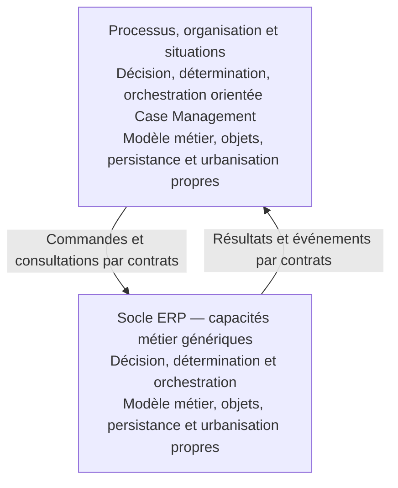

# Orientation : deux urbanisations métier reliées par contrats

Date : 9 septembre 2026. Apports de Laurent : [U18](01-contributions-utilisateur.md#u18), [U19](01-contributions-utilisateur.md#u19), [U20](01-contributions-utilisateur.md#u20). Assertions : F104–F110. Analyse Codex : A14, [P60–P62](05-propositions.md#p60). Les exemples et noms proposés ci-dessous restent à discuter.

## Intention exprimée

Laurent distingue deux ensembles métier, avec modèles, objets, persistances et urbanisations propres :

- Le socle ERP porte les capacités liées au métier de l’entreprise, envisagées de manière générique, les faits de gestion, les grands référentiels et les ressources critiques comme le stock. Son modèle doit être indépendant de l’organisation et des outils.
- La couche processus porte les applications, l’organisation, les rôles et habilitations RBAC, ainsi que les situations et transactions longues. Elle possède son propre modèle métier durable, indépendant des outils et de la réalisation du socle.

Portée réaffirmée par Laurent en [U50](01-contributions-utilisateur.md#u50), le 10 septembre 2026 : **la capability map cible la couche transactionnelle ; un autre modèle fonctionnel orienté processus décrira la couche processus**. Ce second modèle s’inscrit dans l’orientation Case Management de U49 ; son formalisme détaillé n’est pas arrêté. Les deux modèles restent distincts et leurs relations rendent explicite la mobilisation des capacités du socle. Les deux communiquent par contrats durables, avec API et EDA envisagées. Cette orientation guide l’exploration ; elle ne fixe pas encore les affectations détaillées ou les produits.

## Décision, détermination et orchestration dans les deux couches

Précision de Laurent du 10 septembre 2026 : [U49](01-contributions-utilisateur.md#u49), F145/F146. **Les deux couches sont envisagées avec un moteur de décision, détermination et orchestration**, avec une orientation Case Management dans la couche processus. Cette orientation corrige la formulation précédente de A28/P75 (C40), qui plaçait trop largement les moyens génériques dans la seule couche haute.

La frontière proposée porte sur le métier traité par ces moyens, pas sur leur présence :

| Aspect | Socle transactionnel — exemples proposés | Couche processus — exemples proposés |
| --- | --- | --- |
| Détermination | Calculer une disponibilité ou les ressources nécessaires à un résultat. | Déterminer les travaux restant à accomplir dans un dossier et les intervenants admissibles. |
| Décision | Appliquer les règles d’éligibilité, de priorité ou d’engagement d’une ressource. | Décider de poursuivre, suspendre ou escalader le traitement d’un dossier. |
| Orchestration | Coordonner les opérations métier nécessaires au résultat demandé, au sein du socle. | Coordonner tâches, échanges, attentes et exceptions d’une situation, en sollicitant les capacités du socle par contrat. |
| Modèle propre | Ressources, demandes, engagements, faits de gestion et règles qui les gouvernent. | Objets métier de processus, dont Demande de réassort (U62), dossiers, objectifs, tâches, responsabilités et faits de traitement. |

Ces exemples sont une lecture Codex de l’orientation, pas des attributions exhaustives validées. Détermination, décision et orchestration sont des aspects à distinguer sans imposer trois produits, trois composants ou trois nouvelles natures de capacité. L’automatisation n’exclut pas des décisions humaines lorsque le métier les prévoit. La durée, le synchronisme ou la présence d’un humain ne suffisent pas à fixer la frontière.

Une même solution pourrait soutenir les deux couches ; le choix reste ouvert selon U49. Cette possibilité ne décide ni d’une instance commune ni du partage des règles, modèles ou persistances. Les autorités métier et contrats restent explicites. Un moteur peut exécuter les règles du domaine ; leur sens et leur autorité restent portés par le modèle concerné.

La présence de ces moyens ne crée pas automatiquement une capacité générique « Orchestration » dans le catalogue commerce. La carte décrit l’aptitude métier, tandis que la vue de réalisation indique le moyen employé pour l’exercer. Le placement de ces moyens dans les deux couches est une orientation locale déclarée, pas une prescription déduite d’un standard.

## Lecture proposée

Je comprends la généricité comme celle du métier exercé : ici le commerce, dans les frontières convenues. Réserver une quantité, tenir un engagement ou enregistrer une réception sont des responsabilités formulables sans connaître le nom des équipes ni l’application qui les exécute. L’organisation décrit comment Beaumanoir mobilise ces possibilités, répartit les tâches, organise les délégations et résout les situations.

Je propose donc les expressions **urbanisation des capacités métier génériques du socle** et **urbanisation des processus, de l’organisation et des situations**. Ce sont des intitulés locaux à éprouver, pas des termes présentés comme normatifs.

Le dessin présente les interactions principales proposées, sans imposer une topologie exhaustive. Chaque urbanisation pourra contenir plusieurs domaines, services et applications. Un modèle durable n’impose ni un schéma de données unique pour toute une couche, ni une correspondance un pour un entre leurs objets.

Les services du socle ont aussi une implémentation logicielle. Les applications de la couche haute expriment les usages et le traitement organisationnel ; la distinction ne porte donc pas sur la présence ou l’absence de logiciel.

## Deux modèles et deux autorités sur les faits

Exemples proposés, sans description nouvelle de l’existant :

| Socle opérationnel | Processus et situations |
| --- | --- |
| Article, quantité, mouvement, réservation | Dossier, objectif, tâche, tentative |
| Engagement et résultat d’une opération | Affectation, échéance, délégation, escalade |
| Règles de validité des engagements | Règles de conduite et de traitement du dossier |
| Autorité sur les faits opérationnels de son domaine | Autorité sur les faits de traitement de son domaine |

Un dossier peut conserver la référence d’une réservation et la réponse qu’il a reçue. Il ne devient pas pour autant propriétaire du stock réservé. Des copies de consultation sont possibles si leur origine et leur fraîcheur sont explicites. Je propose de faire passer les modifications par les contrats du domaine responsable, sans écriture directe dans la persistance de l’autre couche.

Le terme « transactionnel » désigne ici le socle opérationnel dans l’orientation de Laurent. Les dossiers de la couche haute ont eux aussi des changements d’état à rendre cohérents. La durée d’un dossier ne détermine donc pas, seule, la frontière des deux couches.

## Ce que les références du marché apportent

Les références et les passages examinés sont détaillés dans [le catalogue marché](../marche/catalogue.md), [les éléments](../marche/elements.md) et [CMP009–CMP012](../marche/comparaisons.md#cmp009).

| Appui | Distinction utilisable | Limite du rapprochement |
| --- | --- | --- |
| SAP RBA/RSA | Modèles de capacités et de processus distincts, reliés à leurs réalisations de solution | Deux modèles métier ne prescrivent pas deux plateformes |
| OASIS SOA-RM 1.0 | Accès à une capacité par un service décrit, avec contraintes et contrat | Appui aux frontières ; aucune prescription d’un ERP à deux couches |
| OMG BPMN / CMMN / DMN | Processus, dossiers évolutifs et décisions | Langages complémentaires ; ne constituent pas l’urbanisation complète de la couche haute |
| OpenAPI / AsyncAPI | Description des interfaces HTTP et des API à messages | Le format ne garantit pas à lui seul la stabilité du sens métier |

La distinction SAP laisse les processus eux-mêmes indépendants des produits ; elle est compatible avec le modèle durable de la couche haute demandé par Laurent. Une Business Capability au sens de SAP peut aussi concerner le service client et être réalisée par plusieurs moyens. Réserver notre catalogue au socle est donc un choix de portée à expliciter. Le libellé « capacités métier du socle » permet de conserver cette intention sans revendiquer une définition universelle plus étroite. Sources : [SAP — Defining Business Architecture](https://learning.sap.com/courses/intelligent-enterprise-architecture-fundamentals/defining-business-architecture) et [Discovering the Reference Architecture Content](https://learning.sap.com/courses/sap-enterprise-architecture-framework-foundation-introduction/discovering-the-reference-architecture-content).

TOGAF et ArchiMate restent des appuis de méthode et de représentation ; les textes consultés n’établissent pas l’équivalence « Business Capability = couche transactionnelle ». Les chapitres normatifs ArchiMate visés n’ont pas été accessibles pendant cette vérification ; cette conclusion ne revendique pas un audit normatif exhaustif.

Le DDD fournit un appui pour protéger les règles et rendre un modèle indépendant de son infrastructure. Mais la couche Application présentée dans la documentation Microsoft est une coordination interne à un logiciel : elle n’équivaut pas à notre urbanisation haute dotée de son propre métier. Le même principe de séparation modèle/outils peut être appliqué dans chacun des deux ensembles. Source : [Microsoft — Designing a DDD-oriented microservice](https://learn.microsoft.com/en-us/dotnet/architecture/microservices/microservice-ddd-cqrs-patterns/ddd-oriented-microservice), sections sur les couches Domain et Application, consultées le 2026-09-09 ; référence R13, pratique de conception et non standard d’urbanisation.

## Où éprouver la frontière

Un socle générique peut recevoir des politiques contextualisées et des références de marque, canal, propriétaire ou lieu. Ces dimensions peuvent avoir un sens métier ; l’indépendance de l’organigramme n’oblige pas à les effacer. Il faut examiner séparément qui définit la politique et qui contrôle les engagements qu’elle autorise.

Le quota ship-from-store donne un cas concret : deux traitements simultanés ne devraient pas chacun consommer la dernière place disponible selon leur propre compteur. Je propose un contrôle partagé du quota engagé, sous la politique applicable, avec dérogation explicite si elle est autorisée. Le placement exact de la tenue de charge reste à décider ; ce raisonnement ne prouve aucune garantie du SI actuel.

De même, affecter une tâche à un responsable et autoriser une opération sur le stock sont deux responsabilités. La gestion des rôles peut relever du modèle organisationnel ; l’autorisation doit rester effective lorsque l’opération est appelée, y compris par une API. Le socle peut s’appuyer sur une autorité de droits et des permissions contextualisées sans porter lui-même l’organigramme. C’est une recommandation d’architecture, pas une topologie prescrite par RBAC. [NIST — RBAC FAQ](https://csrc.nist.gov/Projects/Role-Based-Access-Control/faqs), définition et contraintes d’accès, consultées le 2026-09-09 ; R30.

## Des contrats durables, avec un sens métier

Le modèle OASIS apporte la distinction entre service, description et contrat ; il inclut les effets attendus et les conditions d’usage. Il ne réduit pas un contrat au format technique de l’interface. [OASIS SOA-RM 1.0](https://docs.oasis-open.org/soa-rm/v1.0/soa-rm.html), §§3.1, 3.3.1 et 3.3.2, consultés le 2026-09-09.

Pour notre architecture, je propose de documenter :

- Le sens de chaque commande, résultat et événement, avec son autorité et les états concernés.
- Les conditions d’acceptation, effets, refus, droits nécessaires et éventuelles dérogations.
- Le traitement d’une demande rejouée, d’une réponse tardive ou d’une interruption ; les garanties de cohérence nécessaires.
- L’évolution compatible des contrats, le traitement des versions et des dossiers déjà ouverts.

OpenAPI 3.2.0 et AsyncAPI 3.0.0 sont des formats examinés pour ces échanges, sans choix technique adopté : [OpenAPI](https://spec.openapis.org/oas/v3.2.0.html), introduction ; [AsyncAPI](https://www.asyncapi.com/docs/reference/specification/v3.0.0), introduction. Les deux modèles peuvent traduire leurs objets internes vers les concepts du contrat. L’autonomie signifie pouvoir faire évoluer l’implémentation tout en respectant ces engagements.

## Cas d’épreuve et suites

Priorité désormais fixée par Laurent (U21) : explorer d’abord la couche transactionnelle. La [première vue des capacités du socle](16-capacites-socle-transactionnel.md) applique cette priorité ; les frontières avec l’autre couche restent explicites.

Reprendre le ship-from-store GBM avec trois faits déjà sourcés : délai de réponse de quinze minutes, nouvelle sollicitation après refus/expiration, commande client conservée (U04/U05). Décrire séparément les objets et états des deux urbanisations, puis les contrats à leur frontière. Tester notamment la réponse après expiration et la nouvelle présentation d’une même demande, sans inventer le moment actuel de réservation (Q018).

Les candidats CAP019 et CAP033 comportent aujourd’hui résolution de situation et SAV : examiner leur rattachement ou leur décomposition sans perdre leur finalité. Aucun candidat n’est renommé ou déplacé dans cette itération. Questions [Q062–Q064](06-questions.md#q062) ouvertes ; Q001 et Q050 restent ouvertes sur les conventions de niveaux et les règles communes/contextualisées.

## Orchestration des achats : cas d’épreuve U48

La [note sur les trois cas d’achat](21-achats-et-orchestration.md) distingue coordination métier, moyen générique d’orchestration et capacités du socle. P75, précisée après U49/C40, distingue les moyens de décision, détermination et orchestration dans les deux couches, chacune avec son modèle métier propre ; la couche haute est orientée Case Management. Cette proposition n’assimile pas toute coordination à une fonction technique et ne fixe aucune plateforme ; les engagements et ressources de la fabrication à façon sont à éprouver séparément.

## OMS et Supply après U54–U57

Pour Laurent, l’OMS est un Case Management préimplémenté pour la vente, au-dessus du transactionnel Supply. Les parcours de réassort, eCommerce et retour appartiennent à cette lecture de processus. La Supply est la couche transactionnelle de contrôle, orchestration et optimisation de la logistique ; elle sert les commandes du commerce et porte ses décisions de backoffice sur rééquilibrage, prévision et impondérables.

La [note de réexamen](23-reassort-transferts-et-promesse.md) précise les problèmes communs et les frontières. Les moteurs peuvent exister dans les deux couches ; ni leurs modèles ni leurs persistances ne sont fusionnés. Les réalisations de produits et le partage avec C-Log restent à documenter ; le type de parcours commercial ne définit pas à lui seul un domaine du socle.

## Périmètre de développement FLOW après U58

La logistique est hors du développement de la plateforme du Programme FLOW et reste en adhérence (F158). Le modèle fonctionnel Supply ci-dessus ne vaut pas affectation de toutes ses aptitudes à la réalisation FLOW, notamment pour le rééquilibrage, la prévision et les aléas. Décrire les informations, décisions et contrats à la [frontière logistique](23-reassort-transferts-et-promesse.md#périmètre-flow-et-adhérence-logistique), sans internaliser les moyens logistiques ni modifier les responsabilités installées par hypothèse.

## Objets, faits et documents après U61

Laurent distingue les objets métier de la plateforme, rapprochés d’aggregate roots, des faits de gestion associés à des documents représentant des états ou des objets non modifiables produits/captés. La [note d’articulation](24-capacites-objets-et-faits.md) propose de faire émerger leur sens avec les capacités dans un modèle métier lié, puis de préciser leur réalisation avec la conception. Les deux couches conservent leurs modèles ; l’analogie ne fixe ni agrégats, ni schémas, ni persistance événementielle.

U62 précise que les processus s’appuient souvent sur des objets métier, par exemple Demande de réassort dans l’approche Case Management, et que les domaines transactionnels ont également leurs objets. La [mise en regard des deux modèles](24-capacites-objets-et-faits.md#des-objets-métier-dans-les-deux-couches) propose d’examiner problème, règles, cycle de vie et autorité pour préciser les responsabilités ; la qualification d’objet métier ne fixe pas la couche.

## Maîtrise des références — U97/U98

La présence de références opérationnelles et de persistance dans le socle ne lui attribue pas la maîtrise de Party / Role, Agreement ou Catalog. Laurent demande trois domaines contigus à ingestion seule, alimentés par des applications maîtres externes. Leurs modèles distincts se relient par identifiants. Les commandes restent distinctes des Agreements ; la promesse applique leurs conditions particulières. Voir [P85 et la carte courante](25-domaines-coeur-et-epreuve-recits.md#référentiels-ingérés-u97u98), C64 et INF18–INF20.

## Documents d’autorisation et décisions contextuelles — U100

Laurent précise la Supply générique par des documents prouvant l’autorisation de déplacer des marchandises. Les parcours achat/vente/après-vente/réassort restent dans le modèle processus, tandis que le socle décide selon le contexte. DMN est cité comme exemple, sans décision de réalisation. Les deux couches restent métier ; le socle n’est pas réduit à un moteur technique ou au seul transport. [Note de référence](26-supply-documents-autorisations.md), F210/F211/C66 : autorisation, engagement d’exécution et fait réel à distinguer ; D04/D07 à revoir. Autonomie et adhérence C-Log conservées.
