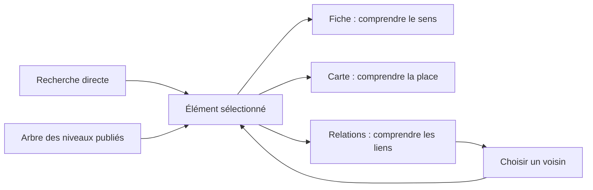

# Atlas : explorer le modèle, ses niveaux et ses relations

Étude d’inspiration du **14 septembre 2026**, demandée en [U143](../../../connaissance/01-contributions-utilisateur.md#u143). Les appréciations et propositions ci-dessous sont celles de Codex ; aucun moteur n’est adopté à ce stade.

**Décision ultérieure U150 :** après l’essai U146, Laurent valide **React Flow et l’interface sur mesure** pour Atlas. Le choix est arrêté ; les alternatives exposées dans cette étude restent historiques. Voir la [validation](../../../connaissance/01-contributions-utilisateur.md#u150) et le [bilan de l’essai](../../../prototypes/atlas-exploration/bilan.md).

**Ma recommandation : reprendre les parcours de LikeC4 et d’IcePanel, puis éprouver React Flow pour construire la vue graphique d’Atlas.** Cytoscape.js est un candidat complémentaire pour l’analyse des relations lorsque ce besoin se précisera. LikeC4 mérite aussi un essai comme moteur intégré : sa proximité avec l’expérience recherchée et son outillage IA en font une véritable alternative.

Le point décisif est la continuité du parcours : retrouver le même élément dans l’arbre, comprendre sa place sur la carte, lire sa fiche, puis suivre une relation sans perdre son contexte. Le choix de bibliothèque vient servir cette expérience.

## 1. Ce qui a été examiné

Recherche dans les documentations officielles, dépôts des projets et démonstrations publiques de huit références. Le [registre des sources](sources.md) distingue les bibliothèques, produits, outils de modélisation et exemples adjacents. Ces références concernent l’interface ; elles ne proposent aucune équivalence avec les capacités métier Beaumanoir.

Un parcours a été effectivement réalisé dans le **Playground LikeC4** : vue d’ensemble, sélection de « Our SaaS », ouverture de sa vue interne, observation des groupes Frontend et Backend Services avec maintien du client externe en contexte. Les autres interactions décrites viennent de la documentation ; il ne s’agit pas d’un test utilisateur comparatif ni d’un benchmark de performance. Aucun package n’a été installé.

L’état local examiné est **Urbanisation v003, publication `2026-09-13.5`** : 51 nœuds, 36 capacités, 50 relations, avec les univers Supply et Case. Il contient déjà une relation transverse proposée entre D07.c et D04.h. Les objets, documents et événements ne constituent pas encore un inventaire publié. Les [empreintes de départ](etat-examine.json) permettent de contrôler que l’étude n’a modifié ni l’application ni ces modèles.

## 2. Les quatre pistes principales

| Piste | Nature | Ce qui nous intéresse | Limite ou coût pour Atlas | Position proposée |
| --- | --- | --- | --- | --- |
| **LikeC4** | Modèle textuel, vues et moteur de restitution ouvert | Entrer dans un élément, changer d’échelle, conserver son contexte ; plusieurs vues du même modèle | Adapter le JSON Atlas, ses identifiants et ses relations aux conventions LikeC4 | Première référence de parcours ; alternative réelle de moteur |
| **IcePanel** | Application de modélisation et collaboration | Cohérence des objets entre vues, recherche, perspectives et parcours racontés | Produit avec son modèle et son service ; pas une bibliothèque d’interface directement substituable | Source d’inspiration produit |
| **React Flow** | Bibliothèque de composants graphiques React | Cartes métier personnalisées, interactions et intégration avec la fiche et l’arbre | Ajouter React et une construction des assets ; concevoir les règles de navigation et le placement | Premier candidat pour une interface Atlas sur mesure |
| **Cytoscape.js** | Bibliothèque JavaScript de graphes | Voisinages, chemins, filtrage, réseaux et algorithmes | Une fiche riche demande davantage de composition autour du rendu graphique | Candidat pour l’exploration analytique des relations |

Les lignes suivantes fondent cette comparaison. Les positions proposées restent des jugements de conception pour Atlas, pas un classement universel des produits.

### LikeC4 : la meilleure piste pour comprendre en parcourant

LikeC4 autorise des types propres au projet et des imbrications libres : son nom n’impose pas quatre niveaux fixes. Les vues sélectionnent une partie du modèle ; une vue peut être centrée sur un élément. Le modèle et les vues sont décrits en texte, ce qui facilite leur génération et leur revue. [Projet](https://github.com/likec4/likec4), [vues](https://likec4.dev/dsl/views/).

Dans la démonstration parcourue, trois intentions sont séparées : naviguer vers une vue, examiner les relations et ouvrir les détails. Entrer dans « Our SaaS » révèle son intérieur en gardant le client à l’extérieur. **À reprendre : un changement d’échelle explicite, avec des repères stables.** [Démonstration parcourue](https://playground.likec4.dev/w/tutorial/saas/).

L’intégration est possible avec des composants React ou des Web Components. Nous pourrions donc produire une projection depuis le JSON publié, sans remplacer l’autorité du modèle par un fichier LikeC4 édité en parallèle. C’est une architecture proposée, dont la fidélité doit être vérifiée. [Intégration React](https://likec4.dev/tooling/code-generation/react/), [Web Components](https://likec4.dev/tooling/code-generation/webcomponent/).

Deux points nécessitent un essai précis : les points ne sont pas admis dans les identifiants locaux du DSL, alors qu’Atlas possède `D02.b` ; il faut une correspondance bijective explicite. De plus, LikeC4 sait produire des relations visuelles agrégées à partir des descendants. Une liaison entre deux blocs repliés doit donc pouvoir révéler les relations publiées qu’elle résume. [Modèle et identifiants](https://likec4.dev/dsl/model/), [sélection et relations inférées dans les vues](https://likec4.dev/dsl/views/predicates/).

### IcePanel : un modèle vivant à travers plusieurs vues

Le Model Viewer documente une disposition automatique en grille, l’ouverture des éléments imbriqués, la mise en évidence des connexions et leur inspection. La recherche globale retrouve plusieurs natures de contenu. Ce sont de bonnes références pour articuler recherche directe et découverte progressive. [Model Viewer](https://docs.icepanel.io/core-features/model-viewer), [recherche globale](https://docs.icepanel.io/core-features/global-search).

Les perspectives permettent d’examiner la même carte par tags. Les flows racontent une séquence sur les objets existants. Les liens de partage peuvent conserver des paramètres de vue et une version. **À reprendre : changer la question posée au modèle sans reconstruire une carte indépendante.** [Perspectives](https://docs.icepanel.io/visual-storytelling/perspective-tags), [flows](https://docs.icepanel.io/visual-storytelling/flows), [partage](https://docs.icepanel.io/collaboration/sharing).

Atlas doit cependant garder ses propres niveaux et sa fiche centrale. Les trois niveaux de diagrammes C4 documentés par IcePanel ne constituent pas notre métamodèle ; les détails ne doivent pas redevenir une colonne étroite à droite. Un flow est une séquence explicitement décrite, pas un ordre déduit d’un réseau de relations. [Diagrammes](https://docs.icepanel.io/core-features/diagramming), [distinction entre connexions et flows](https://developer.icepanel.io/core-concepts/flows).

### React Flow : le meilleur candidat pour nos cartes métier

Un nœud React Flow peut être un composant React personnalisé : titre, type, statut, informations structurées et actions. Cela convient aux capacités actuelles et, plus tard, aux objets métier, documents et événements. Les arêtes peuvent également être personnalisées. [Nœuds personnalisés](https://reactflow.dev/learn/customization/custom-nodes), [API](https://reactflow.dev/api-reference).

L’intérêt pour Atlas est de maîtriser la quantité d’information et les interactions : une carte lisible dans le graphe, une fiche complète au centre, une sélection commune avec l’arbre. La documentation couvre le clavier, le focus et les libellés ARIA personnalisables. Ces mécanismes fournissent une base ; ils ne garantissent pas automatiquement l’accessibilité des composants que nous écrirons. [Accessibilité](https://reactflow.dev/learn/advanced-use/accessibility).

React Flow ne fournit pas à lui seul la disposition automatique du modèle. **ELK** est à éprouver pour les groupes imbriqués, tailles variables et points de connexion ; **Dagre** est une option plus simple pour une vue dirigée peu complexe. Ce choix doit se faire sur nos cas, pas en installant tous les moteurs. [Placement dans React Flow](https://reactflow.dev/learn/layouting/layouting), [ELK.js](https://github.com/kieler/elkjs), [Dagre](https://github.com/dagrejs/dagre).

### Cytoscape.js : très pertinent pour les relations à venir

Cytoscape.js dispose de collections, sélecteurs, voisinages, parcours et algorithmes de chemins. Son fonctionnement sans affichage permet de tester des calculs de graphe indépendamment de l’interface. Il peut s’utiliser sans React. C’est un bon candidat pour répondre à « quels éléments sont reliés à celui-ci ? » ou « par quels chemins ces éléments sont-ils reliés ? ». [Documentation et API](https://js.cytoscape.org/).

Son rendu sur canvas et ses nœuds composés répondent bien à l’exploration d’un réseau. Pour nos futures cartes avec plusieurs zones de texte et actions, React Flow semble plus direct à personnaliser ; il s’agit d’un jugement d’intégration, pas d’une impossibilité de Cytoscape. Pour une organisation moins hiérarchique, fCoSE apporte un placement de groupes avec contraintes. Un calcul ponctuel, puis une carte stable, serait préférable à un réseau qui bouge pendant la lecture. [Rendu et performances](https://js.cytoscape.org/#performance), [fCoSE](https://github.com/iVis-at-Bilkent/cytoscape.js-fcose).

Je ne recommande pas deux moteurs visibles dès le départ. React Flow sait déjà représenter un réseau de relations. Nous ajouterions Cytoscape si des besoins de parcours, de filtrage ou de densité le justifient, éventuellement pour les seuls calculs. Aucun seuil de volume avantageant l’un ou l’autre n’a été mesuré dans cette étude.

## 3. Quatre inspirations complémentaires

| Référence | Mécanisme documenté | Idée transférable à Atlas |
| --- | --- | --- |
| **Kumu** | Focalisation autour d’un élément, profondeur et direction réglables | Ouvrir d’abord les voisins directs ; élargir volontairement le périmètre. [Focus](https://docs.kumu.io/guides/focus) |
| **Obsidian** | Graphe local lié à la note active, avec profondeur réglable | Le graphe accompagne la lecture d’une fiche ; cliquer un voisin recentre l’exploration. [Graph view](https://obsidian.md/help/plugins/graph) |
| **Structurizr** | Navigation entre des vues d’un modèle et outillage textuel/IA | Donner aux vues une identité stable et les vérifier comme du code. [Navigation](https://docs.structurizr.com/ui/diagrams/navigation), [IA](https://docs.structurizr.com/ai) |
| **D2** | Diagrammes textuels composables en layers, scénarios et étapes | Produire plus tard des schémas exportables ou des explications séquencées. [Composition](https://d2lang.com/tour/composition/) |

Kumu ajoute l’inspiration la plus immédiatement utile. Obsidian illustre bien le rôle d’un graphe local, mais un lien entre notes n’a pas la qualification de nos relations métier. Structurizr est davantage lié aux conventions C4. D2 est surtout une piste de restitution ; il n’est pas retenu ici comme premier moteur d’exploration d’Atlas.

## 4. L’expérience que je proposerais pour Atlas

### Un même élément, trois façons de le comprendre

L’arbre reste à gauche, réglable et repliable. Le centre propose **Fiche · Carte · Relations**, avec le même élément sélectionné et le même fil d’Ariane. Changer de vue conserve la publication, le point d’entrée et les filtres utiles. La recherche reste accessible en permanence, notamment par `Ctrl+K`.

Cette boucle conserve un seul contexte d’exploration. Elle ne réintroduit aucun historique de visites récentes.

### Huit idées concrètes

| Idée | Comportement proposé | Garde-fou de compréhension |
| --- | --- | --- |
| **1. Entrer dans la carte** | Supply → Order Management → capacités ; bouton « Explorer » sur les conteneurs, remontée par le fil d’Ariane | Zoomer agrandit la carte ; entrer change le niveau étudié. Les deux gestes restent distincts et disponibles au clavier. |
| **2. Faire respirer les cartes** | Titre et nature visibles, courte finalité au niveau de détail adapté ; définition complète dans la fiche centrale | Une carte ne contient pas toute la fiche. Les relations sélectionnées sont mises en évidence ; les autres passent au second plan. |
| **3. Explorer de proche en proche** | Vue Relations centrée sur l’élément, voisins directs par défaut, entrantes/sortantes et profondeur réglables | Indiquer les éléments masqués. « Relation » reste le terme général ; une dépendance n’est affirmée que si son sens est établi. |
| **4. Lire une relation** | Sélectionner un lien ouvre son sens, sa direction, ses conditions, effets, statut et sources dans l’espace central | La relation possède sa propre identité et sa propre qualification ; elle n’hérite pas automatiquement du statut des nœuds. |
| **5. Garder ses repères** | Placement stable, recentrage doux sur la sélection, bouton « Réorganiser », repères des branches externes | Les transitions respectent la réduction des animations. Une agrégation visuelle annonce le nombre de relations résumées et permet de les ouvrir. |
| **6. Changer de perspective** | Mettre en évidence un type ou un statut, avec légende explicite | « Mettre en évidence » conserve le contexte ; « Filtrer » masque et compte les éléments. L’applicabilité SI attend des évaluations réelles. |
| **7. Donner une forme aux futurs éléments** | Cartes distinctes pour capacité, objet, document et événement, avec pictogramme et libellé de type | Leurs liens métier ne deviennent pas des sous-capacités. Aucun objet ou attribut n’est inventé pour remplir l’écran actuel. |
| **8. Retrouver et partager un point précis** | Recherche avec nom, type et chemin ; ouverture synchronisée dans l’arbre, la carte ou la fiche ; URL avec publication et sélection | Une vue historique reste fixe. La recherche utilise uniquement les données de la publication consultée. |

Visuellement, je retiendrais une **surface calme, des blocs regroupés et des liens contrastés à la sélection**. La profondeur se lit dans les cadres et le fil d’Ariane ; la couleur souligne une perspective choisie. Il faut éviter que nature, statut et domaine se disputent simultanément la même couleur. Une mini-carte devient utile seulement lorsque le périmètre dépasse réellement l’écran.

Sur un écran étroit, l’arbre reste en tiroir. La fiche et la liste des relations constituent des parcours complets ; le graphe ne doit pas être un passage obligé pour accéder à l’information. Sur grand écran, le détail d’une relation peut occuper une zone basse redimensionnable, sans comprimer systématiquement la lecture à droite.

### Un premier exemple réel, déjà disponible

La publication v003 porte `REL-EXECUTION-FACTS-ORDER-RECONCILIATION`, de **D07.c Execution Reconciliation** vers **D04.h Order Reconciliation**. Son sens est que les faits et écarts imputés aux prestations alimentent le rapprochement de la commande, avec distinction des reliquats. La relation reste proposée par l’IA ; les correspondances détaillées sont à préciser. [Modèle examiné](../../../modeles/release/2026-09-13.5/model.json).

Un parcours utile serait : rechercher Order Reconciliation, afficher sa fiche, ouvrir ses relations, comprendre l’apport d’Execution Reconciliation, puis suivre ce voisin. La simple flèche `relates-to` ne suffit pas : l’adaptateur actuel projette des libellés, mais pas `qualification.meaning`, `conditions` et `effects`. Rendre la relation lisible demande donc d’abord de transporter ces informations jusqu’à la vue. [Adaptateur examiné](../../../app/model.js).

Les récits guidés, inspirés des flows IcePanel, viendraient ensuite, sur des scénarios documentés. Un réseau de relations statiques ne suffit pas à générer un processus ou à peupler l’univers Case.

## 5. Ce que « IA friendly » doit signifier ici

La priorité est que je puisse **produire, comprendre, modifier et vérifier le code** de manière fiable. Une interface de conversation avec le modèle serait un autre besoin, ultérieur. La présence d’un bouton IA dans un produit ne répond pas à elle seule au premier critère.

| Critère | React Flow | LikeC4 | Cytoscape.js | IcePanel |
| --- | --- | --- | --- | --- |
| Support pour générer du code | Composants React, types et exemples ; documentation `llms.txt` | DSL déclaratif, skill officiel et validation du modèle | API JS documentée, types, calculs testables sans rendu | API et schémas pour manipuler le modèle du produit |
| Accès IA au modèle | À construire sur notre JSON si nécessaire | MCP officiel de consultation et d’exploration | À construire autour de l’API si nécessaire | MCP documenté, avec droits et fonctions liés à l’offre |
| Contrôle de notre UX | Très direct | Rendu intégrable, conventions à éprouver | Direct sur le graphe ; fiche et navigation à composer | Expérience du produit, pas le code de notre interface |
| Principal travail de maintenance | Composants, état partagé, styles, placement | Adaptateur JSON/DSL, vues, fidélité des liens | Projection, styles, algorithmes et synchronisation | Intégration au service et modèle de données externe |

React Flow fournit plusieurs formats de documentation pour les assistants. Dans son article du 25 mars 2026, xyflow explique avoir privilégié ces documents et ne pas proposer alors de serveur MCP officiel ; les essais de skills avaient été mis en pause. LikeC4 documente au contraire un skill DSL et un MCP, notamment pour les voisinages, chemins et vues. Ce sont deux approches utiles, sans garantie que le code généré soit correct. [Position de xyflow](https://xyflow.com/blog/llms-txt-agent-skills-ai-development), [outils IA LikeC4](https://likec4.dev/tooling/ai-tools/).

Cytoscape fournit ses types depuis la version 3.31.0. IcePanel dispose d’une API, d’exports et d’un MCP ; les fonctions de ce dernier ne couvrent pas indistinctement toute l’interface, notamment la création de diagrammes. Ces capacités rendent leurs modèles pilotables ; elles ne donnent pas à l’IA le code de l’interface IcePanel. [Types Cytoscape](https://blog.js.cytoscape.org/2025/01/13/3.31.0-release/), [API IcePanel](https://developer.icepanel.io/), [MCP IcePanel](https://docs.icepanel.io/integrations/mcp-server).

Pour Atlas, je proposerais les règles de construction suivantes :

1. **Le JSON publié reste l’autorité.** Un adaptateur indépendant fournit les nœuds, liens et métadonnées aux vues ; il se teste sans navigateur.
2. **Les types portent le sens.** Distinguer décomposition `contains`, présentation `presents` et relations transversales. Une arête visuelle agrégée conserve les identifiants des relations sources et se déclare comme résumé.
3. **Le code est découpé par responsabilité.** Arbre, fiche, recherche, cartes, relations et placement ont des composants ou modules séparés. Des contrats TypeScript et une validation des données complètent les exemples.
4. **L’état d’exploration est commun.** Publication, sélection, mode de vue, filtres et profondeur sont synchronisés ; les coordonnées graphiques restent des préférences de présentation.
5. **Les évolutions sont vérifiables.** Versions de dépendances figées, documentation correspondant à ces versions, petites modifications relisibles et tests de parcours. Les tests navigateur vérifient aussi le placement et le focus. [Conseils de test React Flow](https://reactflow.dev/learn/advanced-use/testing).

L’application actuelle n’a pas de dépendance de production JavaScript. React Flow introduirait React, React DOM et une étape de construction des assets. On peut limiter cette introduction à la zone graphique et conserver le serveur Python pour servir les fichiers construits : cette architecture ne requiert pas un serveur Node permanent. Cette possibilité est une proposition technique ; aucune migration n’a été réalisée.

Les cœurs React Flow, Cytoscape.js et LikeC4 sont ouverts sous MIT. React Flow Pro concerne des ressources et services supplémentaires. ELK.js a une licence EPL-2.0 distincte de celle de certains adaptateurs : vérifier les versions et les notices lors de l’intégration. [React Flow Pro](https://reactflow.dev/pro), [Cytoscape.js](https://github.com/cytoscape/cytoscape.js), [LikeC4](https://github.com/likec4/likec4), [licence ELK.js](https://github.com/kieler/elkjs/blob/master/LICENSE.md).

## 6. La suite que je recommande

**Un essai court et comparatif, sur le vrai modèle, avant de généraliser.** Deux réalisations du même petit parcours suffiraient à décider entre une vue React Flow sur mesure et une vue LikeC4 intégrée. Leur seule entrée serait la publication v003 ; les futurs objets et grandes profondeurs seraient éprouvés dans des jeux synthétiques explicitement séparés.

| Étape proposée | Question à résoudre | Critère de réussite |
| --- | --- | --- |
| **1. Carte d’un univers et d’un domaine** | L’exploration par niveaux est-elle naturelle ? | Arbre et carte synchronisés ; Supply, Case et Business References correctement distingués ; aucun parent déduit des identifiants |
| **2. Parcours D04.h ↔ D07.c** | Comprend-on mieux la relation métier ? | Sens, direction, réserve et sources lisibles ; ouverture du voisin puis retour au contexte ; identité de relation conservée |
| **3. Cartes et densité** | Le moteur reste-t-il lisible et simple à maintenir ? | Titres longs, groupes imbriqués, relations nombreuses et tailles variables éprouvés ; temps de placement et fluidité réellement mesurés |
| **4. Navigation complète** | Peut-on utiliser Atlas sans dépendre du graphe ? | Recherche, clavier, fiche, liste de relations, historique de publication et petit écran fonctionnels |

Les documentations des deux bibliothèques soulignent l’influence du rendu, du nombre d’éléments et des mises à jour sur les performances. Il faut donc mesurer les mêmes données et interactions, sans annoncer une capacité en milliers de nœuds à partir d’un exemple de démonstration. [React Flow : performance](https://reactflow.dev/learn/advanced-use/performance), [Cytoscape.js : performance](https://js.cytoscape.org/#performance).

**Mon choix de départ reste React Flow pour la liberté de composition des fiches et objets.** Si l’essai LikeC4 fournit une navigation aussi fidèle avec nettement moins de code, il pourra devenir le moteur principal. Cytoscape sera réévalué quand les relations exigeront une analyse plus poussée. IcePanel et Kumu nourrissent les parcours dès maintenant.

Livraison de cette demande : étude, sources et consignes de conception. Les essais ci-dessus sont proposés, pas exécutés. Aucun code applicatif, modèle métier, publication, commit ou déploiement n’a été modifié ou déclenché par l’étude.

**Suite U146 :** le Go ultérieur autorise l’essai local, réalisé séparément dans `prototypes/atlas-exploration/`. Voir le [bilan comparatif et les captures](../../../prototypes/atlas-exploration/bilan.md). La phrase précédente décrit la livraison de l’étude U143 ; elle ne qualifie pas cette réalisation ultérieure.
