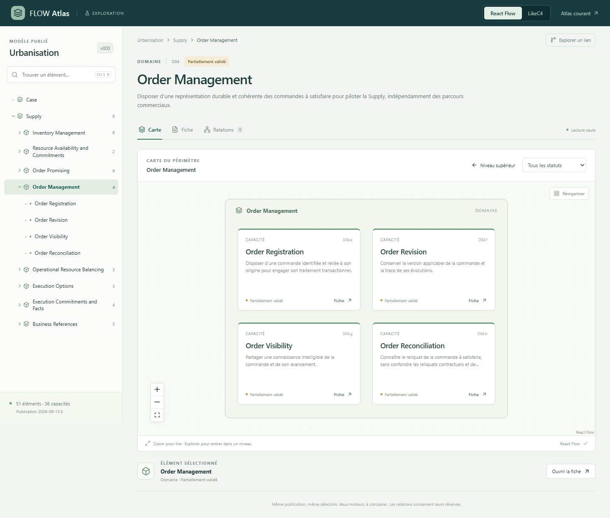
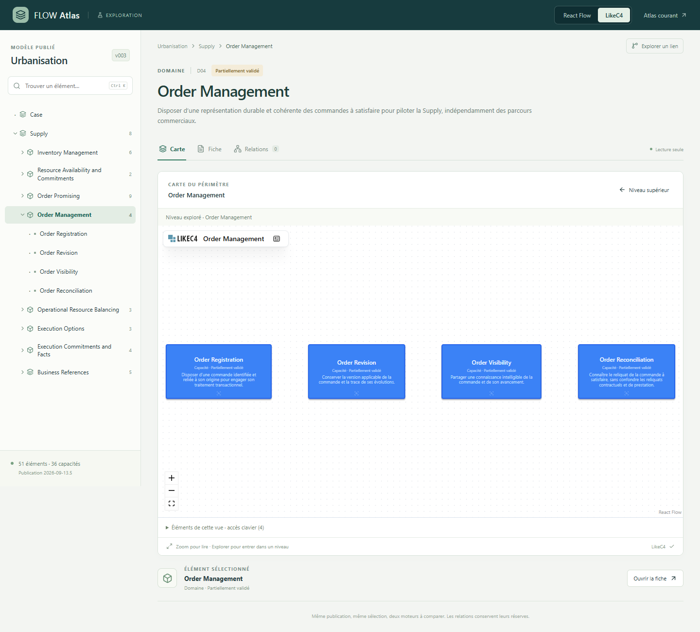

# Essai Atlas : React Flow et LikeC4

**14 septembre 2026 — réalisation U146, après l’étude U143.**

**Décision U150 — React Flow et l’interface sur mesure sont validés par Laurent pour la suite d’Atlas.** La comparaison du moteur est close. LikeC4 n’est plus candidat à l’intégration ; ses qualités et les résultats ci-dessous restent conservés comme enseignements de l’essai. [Validation originale](../../connaissance/01-contributions-utilisateur.md#u150).

Les deux moteurs fonctionnent sur le même modèle publié. La recommandation issue de l’essai favorisait React Flow pour la lisibilité des cartes métier et la maîtrise de leur composition ; LikeC4 apportait des vues d’architecture générées et du contexte entre branches. Le présent bilan conserve les éléments qui ont précédé le choix de Laurent.

## Essayer les deux versions

- [Carte Order Management — React Flow](http://127.0.0.1:8767/#version=2026-09-13.5&node=D04&scope=D04&view=map&engine=react-flow).
- [La même carte — LikeC4](http://127.0.0.1:8767/#version=2026-09-13.5&node=D04&scope=D04&view=map&engine=likec4).
- [Relation Order Reconciliation / Execution Reconciliation](http://127.0.0.1:8767/#version=2026-09-13.5&node=D04.h&scope=D04&view=relations&engine=react-flow).

Le sélecteur en haut permet de changer de moteur en conservant l’élément et la vue. Le parcours conseillé est Supply → Order Management → Order Reconciliation → Relations, puis clic sur Execution Reconciliation. La fiche, les réserves et les sources restent dans le même espace central. La recherche s’ouvre avec Ctrl+K ; les visites récentes restent absentes.

Cet essai consulte **v003 / `2026-09-13.5`**, publication figée commune aux deux rendus, avec 51 nœuds et 50 relations. Les évolutions métier parallèles U144/U145 dans le backlog ne sont pas incorporées. L’Atlas courant reste disponible sur le port 8765 ; le prototype utilise le port 8767.

## Ce que la comparaison montre

| Critère | React Flow dans l’essai | LikeC4 dans l’essai |
| --- | --- | --- |
| **Capacités d’un domaine** | Quatre cartes D04 en grille 2 × 2, avec type, titre, finalité et statut. Lecture plus immédiate. | Quatre cartes disposées en ligne ; le cadrage global réduit davantage le texte. Il faut zoomer ou retravailler la disposition. |
| **Carte de Supply** | Grille régulière des huit enfants explicites, avec le cadre de l’univers. | Disposition orientée par la connexion D07 → D04 ; une liaison résumée est annoncée comme telle. |
| **Relation D07.c → D04.h** | Deux capacités reliées ; accès au sens, aux conditions, aux effets et à la portée sous la carte. | Les deux capacités apparaissent dans leurs cadres de domaine ; même détail métier central. |
| **Navigation et recherche** | Arbre, recherche et sélection partagés ; actions « Explorer » et « Fiche » dans les cartes. | Sélection et navigation reliées au même état ; liste accessible supplémentaire des éléments de la vue. |
| **Liberté de mise en forme** | Composants React personnalisés et styles directement contrôlés. | Diagramme et habillage fournis par le moteur, avec son Shadow DOM ; adaptation supplémentaire pour une apparence entièrement homogène. |
| **Travail propre au moteur** | Un composant de carte et un adaptateur de placement ; grille pour la hiérarchie, ELK pour les relations. | Projection JSON → DSL, correspondance d’identifiants, génération des vues et synchronisation avec l’interface. |
| **Petit écran** | Aucun débordement horizontal aux largeurs testées ; graphes à agrandir, fiche et liste lisibles. | Même constat ; la fiche et la liste évitent de dépendre d’un graphe réduit. |

Les cadrages ne sont pas exactement identiques : React Flow ajoute un cadre à la carte de domaine ; LikeC4 ajoute deux cadres de contexte dans le graphe de relation. Ce sont des éléments visuels, pas des nœuds métier supplémentaires. Les deux projections conservent les identités du même modèle.

**Point de conception appris pendant l’essai :** le placement ELK initial des cartes de Supply donnait deux colonnes et quatre rangées, puis un zoom trop réduit. Une grille déterministe, limitée à trois colonnes, est plus lisible pour cette vue. ELK reste utilisé pour le graphe des relations. Ce résultat concerne ce parcours et ces dimensions, pas une incapacité générale d’ELK ou de LikeC4.

## Captures de l’essai

Les captures ci-dessous ont été prises après stabilisation du cadrage. Elles sont conservées avec le dossier d’étude.

**React Flow — domaine D04**

**LikeC4 — même domaine, mêmes capacités**

Les [relations dans React Flow](../../marche/etudes/2026-09-14-exploration-atlas/essai/react-flow-relations.png) et les [relations dans LikeC4](../../marche/etudes/2026-09-14-exploration-atlas/essai/likec4-relations.png) montrent le même lien proposé, avec son détail central et ses réserves.

## Fidélité au modèle

Le chargeur suit l’index des publications, son descripteur puis le JSON, avec vérification des empreintes. Le navigateur consulte l’API Atlas avec la version du manifeste généré. Un lien demandant une autre publication est refusé ; aucun repli silencieux vers le backlog ou une autre version n’est effectué. La récupération par un lien compatible fonctionne sans recharger le document.

La hiérarchie utilise les relations explicites. D02.b/D02.c restent sous D01 et D02.e sous D03. Dans cette publication, certains rattachements d’univers utilisent `presents` : le rôle du groupe distingue donc les univers des groupes de présentation. Business References n’est pas transformé en niveau sémantique. Les objets, documents et événements sont prévus dans les types, sans instances inventées pour l’essai.

LikeC4 demande un identifiant propre : une table bijective conserve chaque ID Atlas, sans interpréter ses préfixes. Ses liens résumés entre branches annoncent leur nature et retrouvent les identifiants des relations originales. Le détail conserve `qualification`, sources, statut, révision et portées des validations. La flèche D07 → D04 de la vue d’ensemble ne crée pas une nouvelle relation métier entre domaines.

## Vérifications et coûts observés

- **15 tests de données et de projection réussis** : vrai modèle v003, publication historique, identifiants, profondeur synthétique, qualification des relations, recherche, parcours dirigés et absence de mutation.
- **12 familles de contrôles navigateur réussies** : deux moteurs, arbre/carte/fiche, relation qualifiée, conservation de la sélection, source et restitution du focus, recherche clavier, parents non déduits des IDs, absence de visites récentes, mobile et liens directs.
- **Aucune erreur console, HTTP ou requête** pendant ces parcours ; pas de débordement horizontal à 390 et 320 px. La navigation a été contrôlée avec Edge ; aucun audit complet multi-navigateurs ou de lecteur d’écran n’est revendiqué.
- Construction TypeScript/Vite réussie. LikeC4 a généré **103 vues** depuis les 51 nœuds en environ une seconde sur ce poste. Cela ne constitue pas un benchmark comparatif des moteurs.
- Le bundle principal du prototype mesure environ **1,89 Mo** minifié, soit **585 ko gzip**, et inclut React, React Flow, ELK et le shell commun. LikeC4 ajoute un module chargé à la demande d’environ **2,39 Mo**, soit **663 ko gzip**. Ces chiffres décrivent cet essai qui embarque deux moteurs ; ils ne sont pas les empreintes isolées des bibliothèques. Une intégration définitive devra alléger et découper les chargements.

Le [rapport navigateur conservé](../../marche/etudes/2026-09-14-exploration-atlas/essai/verification.json) contient les contrôles, dimensions et résultats. Les treize captures détaillées peuvent être régénérées dans `.runtime/qa/` avec le script de test.

## Conséquence pour une réalisation maintenable par IA

La séparation a fonctionné : contrat de données commun, recherche et arbre indépendants des moteurs, composants de restitution séparés et tests sur les identités. Les versions des dépendances sont fixées dans le verrouillage pnpm. Le modèle publié reste l’autorité ; les fichiers LikeC4 sont des sorties générées et ignorées par Git.

La suite s’appuiera sur **l’interface sur mesure et les cartes React Flow, validées en U150**, en conservant les idées utiles de maintien du contexte et d’explication des relations regroupées. Cytoscape n’a pas été ajouté à cet essai ; son éventuel usage analytique reste distinct du moteur visuel retenu. L’intégration dans l’Atlas courant et son automatisation après publication restent à réaliser. La présente validation ne les présente pas comme déjà livrées.
